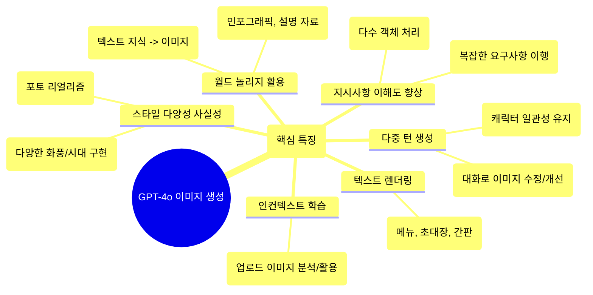

요즘 인공지능(AI) 기술이 하루가 다르게 발전하면서 우리 삶 곳곳에 스며들고 있죠. 특히 `그림 그려주는 AI`는 많은 사람들에게 놀라움과 재미를 선사하며 큰 관심을 받고 있습니다. 그런데 최근 OpenAI에서 기존보다 훨씬 더 똑똑하고 실용적인 이미지 생성 기능을 갖춘 **GPT-4o** 를 선보여 다시 한번 화제가 되고 있습니다. 단순히 멋진 그림을 넘어, 우리가 실제로 ‘쓸모 있게’ 활용할 수 있는 이미지를 만들어낸다는 점에서 주목할 만한 변화인데요. 

오늘은 GPT-4o가 가져온 새로운 이미지 생성의 세계로 함께 떠나보겠습니다.

<!--more-->


### **🎨 그림, 단순한 장식을 넘어 소통의 도구로**

인류는 아주 오래전 동굴 벽화부터 현대의 인포그래픽에 이르기까지, 이미지를 단지 장식용이 아니라 정보를 전달하고, 설득하고, 분석하는 중요한 도구로 사용해왔습니다. 하지만 기존의 AI 이미지 생성 모델들은 때로는 비현실적이거나 환상적인 장면을 멋지게 만들어내면서도, 정작 우리가 일상에서 정보를 공유하거나 무언가를 만들 때 필요한 ‘실용적인 이미지’ `예를 들어 로고, 다이어그램, 정확한 텍스트가 포함된 이미지 등`를 만드는 데는 어려움을 겪곤 했습니다. 마치 그림 실력은 뛰어난데, 우리가 원하는 내용을 정확히 담아내지는 못하는 상황과 비슷했죠.

OpenAI는 바로 이 지점에서 [GPT-4o의 새로운 가능성을 제시](https://openai.com/index/introducing-4o-image-generation/)합니다. GPT-4o 이미지생성 기능은 **언어(텍스트)와 이미지(픽셀)를 통합적으로 이해하는 ‘멀티모달’ 모델**이라는 점이 핵심입니다. 덕분에 단순히 텍스트 설명을 이미지로 바꾸는 것을 넘어, 이미지 안에 글자를 정확하게 써넣거나, 복잡한 요구사항을 더 잘 이해하고, 심지어 우리가 보여주는 이미지를 보고 배우기까지 합니다. 목표는 단 하나, 이미지를 더 ‘쓸모 있게’ 만드는 것입니다.

### **💡 GPT-4o 이미지 생성, 무엇이 달라졌을까?**

그렇다면 GPT-4o는 구체적으로 어떤 능력을 갖추게 되었을까요? 몇 가지 핵심적인 특징들을 살펴보겠습니다.


1.  **글자도 그림처럼, 정확한 ‘텍스트 렌더링’**:
    "백 마디 말보다 한 장의 그림"이라는 말도 있지만, 때로는 그림 속 몇 글자가 전체 의미를 살리기도 하죠. GPT-4o는 이미지 안에 원하는 글자를 비교적 정확하게 그려 넣을 수 있습니다. 식당 메뉴판 디자인, 행사 초대장, 특정 문구가 들어간 광고 이미지 등을 만들 때 아주 유용하겠죠? 마치 디자이너처럼 글자와 이미지를 조화롭게 배치하는 능력이 향상되었습니다.


```프롬프트
[미드센추리(mid century) 스타일 가정집 냉장고에 붙어 있는 자석 시(magnetic poetry)]

첫 번째 줄: "A picture"
두 번째 줄: "is worth"
세 번째 줄: "a thousand words,"
네 번째 줄: "but sometimes"
다섯 번째 줄: "in the right place"
여섯 번째 줄: "can elevate"
일곱 번째 줄: "its meaning."

한 남자가 오른손에는 "a few" 라고 쓰인 (자석) 단어를, 왼손에는 "words" 라고 쓰인 (자석) 단어를 들고 있는 이미지를 그려줘.
```

--- 

2.  **대화하며 다듬어가는 이미지**:
    한 번에 완벽한 이미지를 얻기란 쉽지 않습니다. GPT-4o는 채팅을 통해 이미지 생성을 요청하고, 결과물을 보면서 "이 부분은 이렇게 바꿔줘", "여기에 이런 요소를 추가해줘" 와 같이 자연스럽게 대화하며 이미지를 수정하고 발전시킬 수 있습니다. 예를 들어 게임 캐릭터를 디자인할 때, 대화를 거듭하며 모자나 옷 스타일을 바꿔가도 캐릭터의 기본적인 외형은 일관성 있게 유지되는 식입니다.


```프롬프트
[이미지: 테두리에 약간의 여백이 있는 4컷 만화]

컷 1:
작은 달팽이 한 마리가 화려한 자동차 전시장 카운터 앞에 있습니다. 영업사원은 달팽이를 보려고 몸을 카운터 너머로 한참 숙이고 있습니다.
컷 2:
아주 진지한 표정의 달팽이를 클로즈업합니다. 달팽이가 말합니다:
"여기서 가장 빠른 스포츠카로 주세요... 그리고 문짝이랑, 보닛이랑, 지붕에 커다란 'S' 글자를 페인트로 칠해주세요."
컷 3:
영업사원이 머리를 긁적입니다.
"음... 그건 해 드릴 수 있습니다만, 왜 하필 'S'자인가요?"
컷 4:
장면 전환. 붉은색 스포츠카가 쏜살같이 고속도로를 질주합니다. 차는 온통 거대한 'S'자로 뒤덮여 있습니다. 인도에 있던 사람들이 손가락질하며 웃고 있습니다:
"와! 저 에스카(S-car) 달리는 것 좀 봐!"

식자: (S-CAR GO (에스카 고)는 달팽이를 뜻하는 프랑스어 'escargot(에스카르고)'와 발음이 비슷한 점을 이용한 언어유희입니다.)
```

---

3.  **까다로운 요구도 ‘찰떡같이’ 이해**:
    "파란색 별 옆에 빨간색 삼각형을, 그 아래는 초록색 사각형을..." 와 같이 여러 개의 사물과 그 관계를 설명하면 기존 모델들은 종종 혼란스러워했습니다. GPT-4o는 이전보다 훨씬 더 많은(10~20개 정도) 객체를 포함하는 복잡한 지시사항도 비교적 정확하게 이해하고 이미지로 구현해냅니다. "사람 없는 텅 빈 타임스퀘어"처럼 특정 요소가 '없는' 상태를 구현하는 능력도 보여줍니다.


```프롬프트
뉴턴의 프리즘 실험을 아주 자세히 설명하는 인포그래픽.
이제 워싱턴 스퀘어 파크의 둥근 카페 테이블에서 노트에 이 다이어그램을 그리고 있는 사람의 1인칭 시점(POV)을 생성해 주세요.
```

4.  **보고 배우는 능력, ‘인컨텍스트 학습’**:
    사용자가 직접 이미지를 업로드하면, GPT-4o는 그 이미지를 분석하고 학습해서 새로운 이미지를 만드는 데 참고자료로 활용합니다. 예를 들어, 독특한 디자인의 스케치를 보여주고 "이런 스타일로 자동차를 그려줘"라고 요청하거나, 특정 제품 사진을 주고 "이 제품으로 광고 이미지를 만들어줘"라고 할 수 있습니다.


5.  **세상 지식을 이미지로, ‘월드 놀리지’ 활용**:
    GPT-4o는 방대한 텍스트 정보를 학습했기 때문에, 그 지식을 이미지 생성과 연결할 수 있습니다. 복잡한 과학 실험 과정을 설명하는 인포그래픽을 만들거나, 특정 도시가 왜 안개가 자주 끼는지 시각적으로 설명하는 자료를 만드는 등, 텍스트 지식을 기반으로 유용한 시각 자료를 생성해냅니다.


6.  **진짜 같은 현실감, 다채로운 스타일 구현**:
    다양한 스타일의 이미지를 학습한 덕분에, 매우 사실적인 사진 느낌부터 특정 화풍이나 시대적 감성을 담은 이미지까지 폭넓게 구현할 수 있습니다. 오래된 폴라로이드 사진 느낌, 특정 연도의 디지털카메라로 찍은 듯한 사진 등 사용자가 원하는 분위기와 스타일을 곧잘 연출해냅니다.




### **🤔 아직은 발전 중, 한계점과 안전 노력**

물론 GPT-4o의 이미지 생성 기능이 완벽한 것은 아닙니다. OpenAI 스스로도 몇 가지 한계점을 인지하고 개선 중이라고 밝혔습니다. 예를 들어, 긴 이미지를 생성할 때 일부가 잘리는 경우, 때때로 부정확한 정보를 만들어내는 ‘환각 현상’, 아주 많은 수의 개념(예: 주기율표 전체)을 동시에 정확히 표현하는 어려움, 비 라틴 문자(한글 포함) 렌더링의 부정확성, 이미지 특정 부분만 정교하게 수정하는 능력 부족 등이 있습니다. 특히 사용자가 업로드한 인물 사진을 수정할 때 일관성이 떨어지는 버그는 조만간 수정될 예정이라고 합니다.

한편, OpenAI는 이미지 생성 기술의 오용을 막기 위한 안전장치 마련에도 힘쓰고 있습니다. 생성된 모든 이미지에는 **C2PA 메타데이터**를 포함시켜 해당 이미지가 AI(GPT-4o)에 의해 생성되었음을 투명하게 밝히고, 아동 성 학대물이나 딥페이크와 같은 유해 콘텐츠 생성 요청은 차단합니다. 특히 실제 인물 이미지를 다룰 때는 더욱 엄격한 기준을 적용한다고 강조합니다. 기술 발전과 함께 책임감 있는 사용 환경을 만들기 위한 노력이 병행되고 있는 셈입니다.


### **✨ 그림 그리는 AI, 이제 우리 곁의 '쓸모 있는' 도구로**

GPT-4o의 새로운 이미지 생성 기능은 단순히 기술적인 발전을 넘어, AI가 우리의 창의적인 작업과 소통 방식을 어떻게 바꿀 수 있는지 보여주는 흥미로운 사례입니다. 복잡한 정보를 시각적으로 표현해야 할 때, 머릿속 아이디어를 구체적인 이미지로 만들고 싶을 때, 혹은 반복적인 디자인 작업을 효율화하고 싶을 때, 이제 GPT-4o는 단순한 그림 도구가 아닌, 우리의 생각을 이해하고 시각화하는 ‘똑똑한 조수’가 될 수 있을 것입니다.

물론 아직 개선될 부분도 있지만, 이미지 생성이 언어 모델의 핵심 기능으로 통합되면서 앞으로 더욱 편리하고 강력한 AI 활용 시대가 열릴 것으로 기대됩니다.

오늘 이야기가 GPT-4o의 새로운 이미지 생성 기능에 대한 궁금증을 해소하고, 앞으로 AI 기술이 우리 삶에 어떤 변화를 가져올지 생각해보는 계기가 되었기를 바랍니다. 


