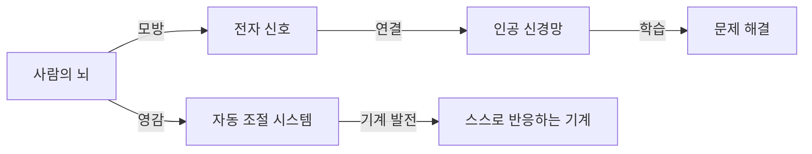
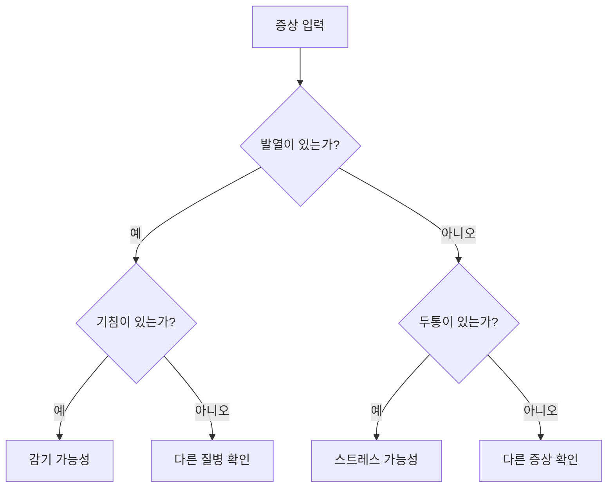
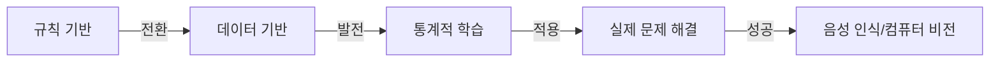
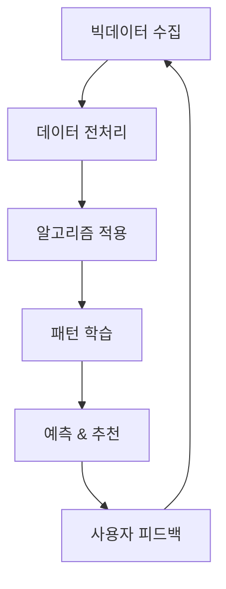
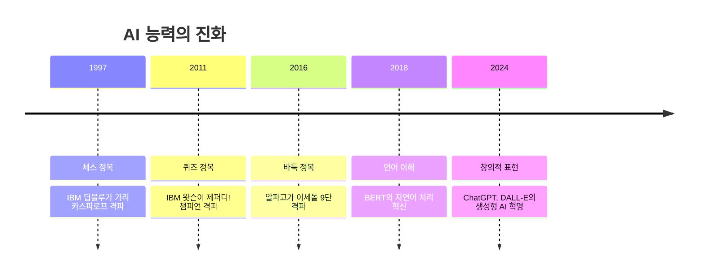
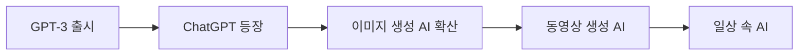
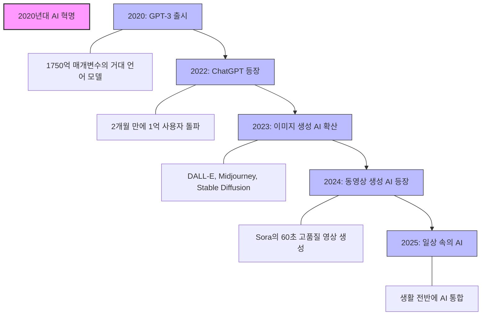

> [!IMPORTANT] 
> **기계가 정말 인간처럼 생각할 수 있을까요?**

<!--more-->
`하단에서 '인공지능 타임라인 PDF'를 다운로드 하실 수 있습니다.`

## 인공지능의 여정: AI 역사의 핵심 순간들

이 황당해 보이는 질문이 과학자들 사이에서 진지하게 논의되기 시작했습니다. 당시로선 SF 영화에나 나올 법한 이 아이디어가 인공지능이라는 거대한 모험의 첫 출발점이었습니다.

인간의 뇌와 기계가 근본적으로는 비슷한 원리로 작동할 수 있다는 대담한 가설은 과학자들의 상상력에 불을 지폈습니다. 그들은 "인간의 지능을 금속과 전선으로 만들어낼 수 있을까?"라는 도전에 뛰어들었고, 이것이 오늘날 우리가 일상적으로 경험하는 인공지능 기술의 씨앗이 되었습니다.

지금부터 단순한 계산기에서 시작해 인간의 창의력까지 모방하는 AI까지, 그 놀랍고 때로는 좌절로 가득했던 인공지능의 파란만장한 여정을 함께 살펴보겠습니다.

----

### 1940년대: 사이버네틱스와 인공지능의 시작  

> [!NOTE]  
> 사이버네틱스는 "기계도 사람처럼 스스로 조절할 수 있을까?"라는 질문에서 출발했습니다.
> 예를 들어, 우리가 더우면 땀을 흘려 체온을 조절하듯, 기계도 비슷한 방식으로 스스로 반응하고 조절할 수 있다는 생각입니다.

#### 기계도 생각할 수 있을까?  

1940년대, 사람들은 처음으로 "우리 뇌는 전기 신호로 작동하는데, 기계도 비슷한 방식으로 정보를 처리할 수 있지 않을까?"라는 생각을 하기 시작했습니다. 

이 아이디어를 주도한 사람은 **노버트 위너**라는 수학자였어요. 그는 2차 세계대전 중 대공포(하늘을 나는 적 비행기를 격추하는 무기)의 조준 시스템을 개발했습니다.

위너는 대공포가 목표물을 추적하고 움직임을 예측하는 과정이, 마치 우리가 공을 잡을 때 뇌가 손의 움직임을 조정하는 방식과 비슷하다고 생각했습니다. 

이렇게 해서 **사이버네틱스**라는 개념이 탄생했어요. 즉, "사람의 신경계처럼 작동하는 기계를 만들 수 있을까?"라는 아이디어였습니다.

#### 사이버네틱스의 핵심 원리  

이 개념은 이후 인공지능(AI)의 기초가 되었어요.  

---

### 1950년대: 컴퓨터가 생각할 수 있을까?

1950년대는 오늘날 우리가 알고 있는 컴퓨터의 기초가 다져진 시기입니다. 이 시기에 앨런 튜링이라는 천재 수학자가 "기계가 생각할 수 있을까?"라는 중요한 질문을 던졌습니다.

튜링은 이 질문에 답하기 위해 '튜링 테스트'라는 간단한 실험을 제안했습니다. 만약 사람이 컴퓨터와 대화를 나누면서 그것이 기계인지 사람인지 구별할 수 없다면, 그 컴퓨터는 '생각할 수 있다'고 간주할 수 있다는 아이디어였죠.

> [!TIP]
> 튜링 테스트는 컴퓨터와 사람이 대화를 나누고, 판정관이 누가 컴퓨터인지 구별할 수 없다면, 그 컴퓨터는 '생각할 수 있다'고 봐도 좋다는 것이죠. 오늘날 ChatGPT 같은 AI와 우리의 대화도 이 테스트의 현대적 버전이라고 볼 수 있어요.

이 시대에 처음으로 '인공지능'이라는 아이디어가 구체적인 형태를 갖기 시작했습니다. 과학자들은 단순히 계산만 하는 기계가 아닌, 인간처럼 사고하고 학습할 수 있는 기계를 만들겠다는 원대한 꿈을 꾸기 시작했습니다.

이 시기의 컴퓨터는 오늘날 스마트폰보다도 연산 능력이 훨씬 떨어졌습니다. 하지만 과학자들의 꿈은 컴퓨터의 성능보다 훨씬 앞서 있었죠. 마치 라이트 형제가 초기 비행기를 만들 때, 그들의 꿈은 이미 달에 가는 것이었던 것처럼요.

1956년 다트머스 회의는 마치 슈퍼히어로 영화의 어벤저스가 처음 모이는 장면 같았습니다. 존 매카시, 마빈 민스키, 클로드 섀넌 등 컴퓨터 과학의 천재들이 모여 "인공지능"이라는 새로운 연구 분야를 공식적으로 만들었습니다.

---

### 1960-70년대: 초기 AI의 낙관과 현실의 벽

1960년대는 AI에 대한 낙관으로 가득 찬 시기였습니다. 과학자들은 10년 안에 인간 수준의 AI가 개발될 것이라고 자신했죠.

> [!IMPORTANT]
> 일라이자(ELIZA)는 최초의 챗봇으로, 오늘날 우리가 AI와 대화하는 모든 시스템의 할아버지 같은 존재입니다. 단순한 패턴 매칭을 사용했지만, 많은 사람들이 실제 인간과 대화하는 것처럼 느꼈다는 것이 놀라운 점이었어요.

하지만 초기의 낙관론은 곧 현실의 벽에 부딪혔습니다. 언어 번역이나 물체 인식 같은 인간에게는 쉬운 일들이 컴퓨터에게는 너무나 어려웠죠. 어린아이도 쉽게 고양이와 개를 구별하지만, 이것을 컴퓨터에게 가르치는 것은 엄청나게 복잡한 문제였습니다.

실제로 당시 MIT의 한 여름 프로젝트로 컴퓨터에 시각을 가르치려고 했는데, 이것이 50년 넘게 해결되지 않은 문제가 되었죠!

---

### 1980년대: Winter is Coming

1980년대는 AI가 연구실을 벗어나 실제 비즈니스 세계로 진출하기 시작한 시기였어요. 이 시기에 '전문가 시스템'이라고 불리는 AI 기술이 큰 주목을 받았습니다.

전문가 시스템은 특정 분야의 전문가들이 가진 지식과 경험을 컴퓨터에 입력해서 만든 프로그램이었어요. 쉽게 말해 "만약 A라면, B를 하라"와 같은 규칙을 수천 개 입력해서 전문가처럼 판단하게 만든 거죠.

예를 들어, 의사들이 환자의 증상을 보고 진단하는 과정을 흉내 내는 시스템이 있었어요. 환자가 "열이 있고, 목이 아프다"고 하면 시스템은 "감기일 확률이 높습니다"라고 대답하는 식이었죠.

당시 유명했던 전문가 시스템 중에는 'MYCIN'이라는 것이 있었어요. 이 시스템은 혈액 감염을 진단하고 항생제를 추천했는데, 놀랍게도 전문의사들만큼 정확했다고 합니다.

또 다른 성공 사례로는 'XCON'이라는 시스템이 있었어요. 이 시스템은 컴퓨터 회사 DEC에서 사용했는데, 고객이 주문한 컴퓨터 부품들이 서로 호환되는지 확인하고 조립 방법을 알려주었습니다. XCON 덕분에 DEC는 매년 수백만 달러를 절약할 수 있었죠.

하지만 전문가 시스템에는 큰 문제점이 있었어요. 새로운 상황에 적응하기 어려웠거든요. 예를 들어, 의료 진단 시스템은 이미 알려진 질병에 대해서는 잘 작동했지만, 새로운 질병이 나타나면 무용지물이 되었습니다.

또한 전문가 시스템을 만들고 유지하는 데는 엄청난 노력이 필요했어요. 모든 규칙을 일일이 입력해야 했고, 새로운 지식이 생기면 계속해서 업데이트해야 했으니까요.

> [!WARNING]
> 1980년대 후반, 전문가 시스템의 한계가 드러나면서 AI에 대한 열광은 서서히 식어갔어요. 기업들은 AI에 투자했던 돈을 회수하지 못했고, 정부 지원도 줄어들었습니다. 이렇게 AI 연구에 대한 자금과 관심이 급격히 감소하는 시기를 'AI의 겨울'이라고 부르게 되었죠.

---

### 1990년대: AI의 조용한 혁명

1990년대는 AI가 화려한 스포트라이트에서 벗어나 조용히 발전한 시기였어요. 이른바 'AI 겨울'이 끝나고, 과학자들은 새로운 방향으로 연구를 시작했습니다.

- 패러다임의 전환: 규칙에서 데이터로

이 시기에 가장 중요한 변화는 AI 접근 방식의 전환이었어요. 과학자들은 더 이상 모든 규칙을 일일이 프로그래밍하지 않고, 컴퓨터가 데이터에서 스스로 학습할 수 있는 방법을 개발했습니다.

이것은 마치 아이를 가르치는 방식의 변화와 비슷했어요. 예전에는 "고양이는 귀가 뾰족하고 수염이 있어"라고 직접 규칙을 알려주었다면, 이제는 수천 장의 고양이 사진을 보여주고 스스로 '고양이다움'을 찾아내게 하는 방식으로 바뀐 거죠. 이런 접근법이 오늘날 머신러닝의 기초가 되었습니다.

> [!IMPORTANT]
> 1997년은 AI 역사에 중요한 해였어요. IBM이 개발한 '딥블루'라는 컴퓨터가 세계 체스 챔피언 가리 카스파로프를 이겼거든요. 이 사건은 대중에게 AI의 잠재력을 보여준 상징적인 순간이었습니다. 하지만 이 승리는 정상에 도달한 것이 아니라, 더 높은 산을 오르기 위한 베이스캠프에 도착한 것에 불과했어요. 체스는 규칙이 명확하고 경우의 수가 한정된 게임이었기 때문에, 진정한 인간 지능을 모방하기에는 아직 갈 길이 멀었습니다.

1990년대는 겉으로 보기에 화려하지 않았지만, 이 시기의 조용한 연구들이 나중에 AI 폭발적 성장의 토대가 되었어요. 마치 오랜 시간 땅속에서 자라던 대나무가 어느 날 갑자기 하늘을 향해 솟아오르듯, AI 기술도 이 시기에 심어진 씨앗들이 2000년대와 2010년대에 급격히 성장하게 됩니다.

이 시기에 발전한 신경망 이론, 데이터 처리 기술, 컴퓨터 성능 향상은 나중에 딥러닝 혁명을 가능하게 한 숨겨진 영웅들이었어요. 화려하지 않았지만, 가장 중요한 변화는 종종 조용히 일어나는 법이니까요.

---

### 2000년대: 빅데이터와 AI의 만남

2000년대는 인터넷이 폭발적으로 성장하면서 데이터의 홍수 시대가 열렸어요. 웹 페이지, 이메일, 포럼 등에 쌓인 엄청난 양의 텍스트 데이터는 자연어 처리 연구에 새로운 활력을 불어넣었습니다. 우리가 매일 검색하고, 클릭하고, 좋아요를 누르는 모든 행동이 AI가 학습할 수 있는 소중한 데이터가 된 거죠.

구글, 아마존, 페이스북 같은 기술 기업들은 머신러닝을 비즈니스의 핵심으로 삼았어요. 이들은 사용자의 행동 데이터를 분석해 더 나은 서비스를 제공했습니다. 예를 들어, 아마존은 여러분이 본 상품을 기억했다가 "이 상품을 본 사람들이 구매한 다른 상품"을 추천해주죠.

이 과정에서 기업들은 더 많은 데이터를 모았고, 이 데이터로 더 좋은 알고리즘을 개발하는 선순환이 만들어졌어요. 서비스가 좋아지면 더 많은 사용자가 모이고, 더 많은 데이터가 쌓이고, 알고리즘은 더 똑똑해지는 식이었죠.

2006년은 AI 역사에서 중요한 해였어요. 제프리 힌튼 교수가 발표한 연구가 딥러닝 분야에 혁명을 일으켰거든요. 힌튼은 인공 신경망, 특히 역전파 알고리즘과 비지도 학습 기법 개발에 집중했습니다.

쉽게 설명하자면, 힌튼의 연구는 컴퓨터가 마치 인간 두뇌처럼 여러 층의 '신경 세포'를 통해 정보를 처리하는 방법을 발전시켰어요. 이 기술은 나중에 음성 인식, 이미지 인식, 자연어 처리 등 다양한 분야에 적용되었습니다.

이 시기에는 컴퓨터가 인간의 언어를 이해하고 해석하는 능력도 크게 발전했어요. 기계 번역이 더 정확해졌고, 음성 인식 기술도 실용화되기 시작했습니다.

특히 2011년에는 IBM이 개발한 '왓슨'이라는 AI 시스템이 퀴즈 쇼 '제퍼디!'에 출연해 인간 챔피언들을 이기는 놀라운 성과를 보여줬어요. 왓슨은 방대한 지식을 바탕으로 복잡한 질문을 이해하고 답변하는 능력을 선보였습니다.

2000년대의 발전은 오늘날 우리가 경험하는 AI 혁명의 토대가 되었어요. 제프리 힌튼의 연구는 너무나 중요해서, 2024년 10월에는 "인공 신경망을 이용한 기계 학습을 가능하게 하는 근본적인 발견과 발명"에 대한 공로를 인정받아 노벨 물리학상을 공동 수상하기도 했습니다.

이 시기에 쌓인 데이터와 개발된 기술들은 2010년대에 들어서면서 더욱 놀라운 AI 발전으로 이어지게 됩니다. 마치 오랫동안 준비해온 무대 뒤 리허설이 끝나고, 드디어 화려한 공연이 시작되는 순간이 다가오고 있었던 거죠.

---

### 2010년대: AI 혁명의 시작

2010년대는 AI 역사에서 중요한 전환점이 된 시기였습니다. 특히 2012년과 2016년에 일어난 두 가지 사건은 AI의 잠재력을 세상에 알리는 결정적 순간이었습니다.

2012년, 토론토 대학의 알렉스 크리제브스키, 일리야 수츠케버, 제프리 힌튼 교수 팀이 개발한 AlexNet이 ImageNet 대회(ILSVRC)에서 혁명적인 성과를 거두었습니다. AlexNet은 이전 우승자의 오류율 26%를 15.3%로 크게 낮추며 압도적인 성능을 보였습니다

이 성과는 AI 연구의 방향을 완전히 바꾸어 놓았습니다. 전통적인 머신러닝 방식에서 딥러닝으로의 전환이 시작된 것입니다.

> [!TIP]
> 딥러닝과 머신러닝의 차이가 헷갈리시나요? 피자를 예로 들면, 머신러닝은 피자의 특징(둥글다, 치즈가 있다 등)을 인간이 지정해주고 컴퓨터는 그 특징을 바탕으로 학습하는 것이고, 딥러닝은 컴퓨터가 수많은 피자 사진을 보고 스스로 '피자다움'을 찾아내는 것입니다!

2016년 3월, 구글 딥마인드의 알파고와 세계 최고의 바둑 기사 중 한 명인 이세돌의 5판 대결은 AI 역사의 또 다른 이정표가 되었습니다. 알파고는 4승 1패로 승리했습니다.
이 대결은 많은 전문가들이 예상했던 것보다 10년이나 빠르게 AI가 인간을 뛰어넘는 순간이었습니다. 바둑은 경우의 수가 엄청나게 많은 복잡한 게임이었기 때문에, 이 승리는 AI의 잠재력을 세상에 각인시켰습니다.

---

### 2020년대: 생성형 AI와 일상 속의 인공지능

인류 역사의 물줄기가 바뀌는 순간은 종종 조용히 찾아옵니다. 2020년대 초, 세계가 팬데믹의 혼란 속에 갇혀 있을 때, 인공지능은 조용히 그러나 확실히 혁명의 문턱을 넘고 있었습니다.

2020년, 인류가 바이러스와의 전쟁을 치르는 동안 OpenAI는 1750억 개의 매개변수를 가진 **GPT-3**를 세상에 내놓았습니다. 이 거대한 언어 모델은 마치 인간처럼 글을 쓰고, 질문에 답하고, 심지어 시를 짓기도 했습니다. 그러나 이것은 시작에 불과했습니다.

> [!NOTE]
> 2022년 11월의 어느 날, 한 채팅봇이 조용히 인터넷에 등장했습니다. **ChatGPT**라 불리는 이 프로그램은 출시 후 단 5일 만에 100만 명의 사용자를 끌어모았고, 2개월 만에 1억 명을 돌파했습니다. 넷플릭스가 3.5년, 페이스북이 4.5년 걸린 일을 ChatGPT는 눈 깜짝할 사이에 해낸 것입니다.

이것은 단순한 기술 제품의 성공이 아니라, 인류가 인공지능을 바라보는 시선의 전환점이었습니다.

"인공지능이 내 일자리를 빼앗을까?" 이 질문은 2023년 전 세계 직장인들의 마음을 짓눌렀습니다. 변호사들은 AI가 작성한 법률 문서에 놀라워했고, 프로그래머들은 코드를 자동으로 완성하는 도구에 경외심을 느꼈으며, 작가들은 AI가 쓴 소설을 읽으며 복잡한 감정에 휩싸였습니다. 우리가 인간만의 영역이라고 믿었던 창의성의 성벽이 무너지기 시작한 것입니다.

2023년 중반, **DALL-E**, **Midjourney**, **Stable Diffusion**과 같은 이미지 생성 AI들이 예술계를 뒤흔들었습니다. 몇 초 만에 르네상스 화풍의 우주 비행사나 입체파 스타일의 한국 전통 시장을 그려내는 이 기술들은 예술의 정의와 창작자의 의미에 대한 근본적인 질문을 던졌습니다. 한 디지털 아티스트의 AI 생성 작품이 콜로라도 주 예술 대회에서 우승했을 때, 많은 이들은 이것이 예술의 종말인지, 아니면 새로운 시작인지 고민했습니다.

2024년 초, 구글의 **Gemini**와 OpenAI의 **Sora**는 AI의 경계를 더욱 확장했습니다. 특히 Sora는 단순한 텍스트 설명만으로 60초짜리 영화 같은 비디오를 만들어냈습니다. 할리우드의 특수효과 전문가들도 놀랄 만한 퀄리티였습니다. "상상하는 모든 것을 현실로 만들 수 있다"는 AI 개발자들의 약속이 점점 현실이 되어가고 있었습니다.

이 모든 발전 속에서 우리 사회는 AI에 대한 양가적 감정 사이에서 흔들렸습니다. 한편으로는 AI가 가져올 풍요로운 미래에 대한 기대가 있었고, 다른 한편으로는 통제 불가능한 기술에 대한 두려움이 있었습니다. 일론 머스크와 같은 빅테크 거물들이 AI 개발의 일시적 중단을 요청하는 공개 서한에 서명했을 때, 그것은 단순한 경고가 아니라 인류의 운명에 대한 깊은 고민의 표현이었습니다.

2020년대의 AI 혁명은 인류 역사상 가장 빠른 기술적 변화 중 하나입니다. 증기기관이 산업혁명을, 인터넷이 정보혁명을 일으켰듯이, AI는 지금 지능혁명을 이끌고 있습니다. 이 혁명의 끝은 아직 보이지 않지만, 한 가지 확실한 것은 우리가 인간과 기계의 관계를 재정의하는 역사적 순간의 한가운데 서 있다는 사실입니다.

어쩌면 미래의 역사가들은 2020년대를 인류가 처음으로 자신의 지능을 넘어서는 존재를 만들어낸 시대로 기록할지도 모릅니다. 그리고 그들은 이렇게 물을 것입니다: 

**"그들은 자신들이 무엇을 창조하고 있는지 알고 있었을까?"**

---

## 미래를 향한 도전: AI와 인류의 공존

AI 발전의 역사는 마치 롤러코스터를 타는 것 같습니다. 높은 기대와 깊은 좌절, 그리고 다시 찾아온 혁신의 반복이었죠.

오늘날 우리는 이전 세대가 상상하지 못했던 AI의 세계에 살고 있습니다. 스마트폰 속 음성 비서에게 날씨를 물어보고, AI가 추천한 영화를 보고, 자율주행차 기술의 발전을 지켜보고 있죠.

AI의 미래는 어떻게 될까요? 범용 인공지능(AGI)이 등장할까요? AI가 인간의 창의성과 감성을 완전히 이해할 수 있을까요? 이 모든 질문에 대한 답은 아직 열려 있습니다.

하지만 한 가지 확실한 것은, 1940년대 사이버네틱스 운동에서 시작된 여정이 지금도 계속되고 있으며, 우리는 그 흥미진진한 이야기의 한가운데에 있다는 것입니다. AI의 발전은 단순한 기술의 진보가 아니라, 인간 지능의 본질과 우리 자신에 대한 이해를 깊게 하는 여정이기도 합니다.

AI와 함께하는 미래는 우리가 함께 만들어가는 것입니다. 기술의 발전과 함께 인간의 가치를 지키고, AI를 인류의 파트너로 발전시켜 나가는 지혜가 필요한 시점입니다.

---

[🎁 History Of AI PDF 다운로드](/file/History_of_AI_Poster.pdf)

[🎁 The Road to AGI 2015 - 2025 타임라인 살펴보기](https://koraia.org/default/mp4/sub6.php?sub=06?sub=06)

---

[🚀 여러분의 적극적인 참여를 기다리고 있습니다.](https://stibee.com/api/v1.0/emails/share/G7PhqMG7hDdtfiy3Cy_jN8dPfHr2j_c)