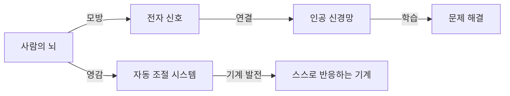
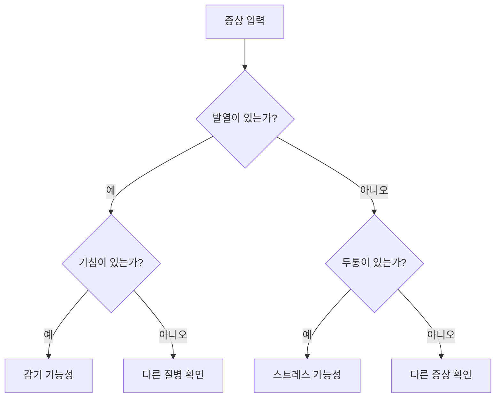
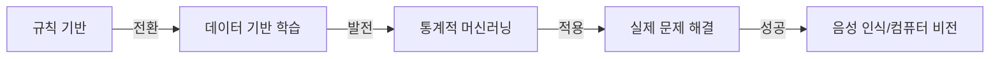
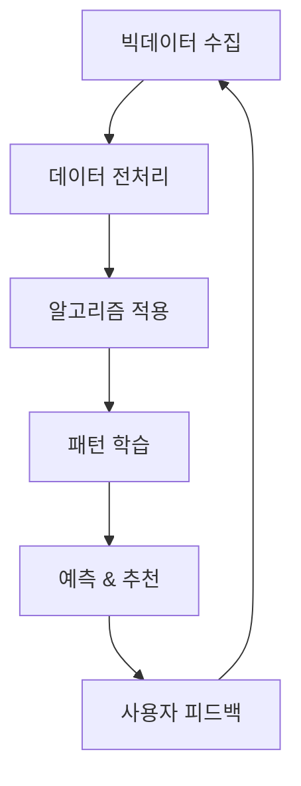
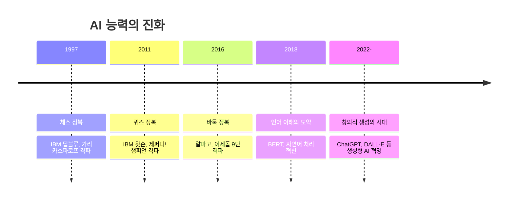
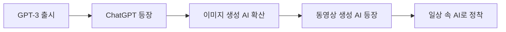

> [!IMPORTANT] 
> **기계가 정말 인간처럼 생각할 수 있을까요?**

<!--more-->
`하단에서 '인공지능 타임라인 PDF'를 다운로드 하실 수 있습니다.`

-----

## **인공지능의 여정: AI 역사의 핵심 순간들**

"기계가 생각할 수 있을까?"

SF 영화에나 나올 법한 이 질문이 과학자들 사이에서 진지하게 논의되기 시작했습니다. 당시로서는 허무맹랑하게 들릴 수 있었던 이 아이디어가, 인공지능이라는 거대한 모험의 서막을 열었습니다.

인간의 뇌와 기계가 비슷한 원리로 작동할 수 있다는 대담한 가설은 과학자들의 상상력에 불을 지폈습니다. 그들은 "인간의 지능을 금속과 전선으로 구현할 수 있을까?"라는 궁극적인 도전에 뛰어들었고, 이는 오늘날 우리가 일상에서 경험하는 인공지능 기술의 씨앗이 되었습니다.

지금부터 단순한 계산기에서 출발해 인간의 창의력까지 넘보는 현재의 AI에 이르기까지, 때로는 희망으로, 때로는 좌절로 가득했던 인공지능의 파란만장한 여정을 함께 따라가 보겠습니다.

-----

### **1940년대: 사이버네틱스와 인공지능의 싹**

> [\!NOTE]
> **사이버네틱스 Cybernetics**는 생명체, 기계, 조직 등 다양한 시스템에서 통신과 제어의 원리를 연구하는 학문입니다. 
> "기계도 사람처럼 스스로 상태를 조절할 수 있을까?"라는 질문에서 출발한 학문으로서, 예를 들어 우리 몸이 더우면 땀을 흘려 체온을 조절하듯, 기계도 외부 환경 변화에 스스로 반응하고 제어할 수 있다는 개념입니다.

#### **기계도 생각할 수 있을까?**

이러한 생각에 불을 지핀 인물은 1940년대 수학자 **노버트 위너**였습니다. 제2차 세계대전 당시, 그는 대공포 조준 시스템을 개발하고 있었습니다. 위너는 대공포가 적기의 움직임을 예측하고 추적하는 과정이, 마치 사람이 날아오는 공을 잡기 위해 뇌와 손의 움직임을 끊임없이 조절하는 방식과 매우 흡사하다는 사실을 발견했습니다.

이처럼 기계와 생명체가 정보를 처리하며 스스로를 제어하는 원리를 탐구하는 학문이 바로 사이버네틱스입니다. 인간의 뇌와 신경계가 전기 신호로 작동하는 방식에서 영감을 얻어, 기계 역시 정보를 통해 학습하고 문제를 해결하는 '자동 조절 시스템'을 만들 수 있다는 가능성의 문을 연 것입니다.

#### **사이버네틱스의 핵심 원리**

사이버네틱스의 개념은 훗날 인공지능(AI)과 로봇 공학의 중요한 철학적, 기술적 토대가 되었습니다.

-----

### **1950년대: '인공지능'의 탄생**

1950년대는 오늘날 우리가 아는 컴퓨터의 기틀이 마련된 시기입니다. 이 시기, 천재 수학자 **앨런 튜링**은 "기계가 생각할 수 있을까?"라는 근본적인 질문을 던졌습니다.

튜링은 이 질문을 증명하기 위해 **튜링 테스트**라는 독창적인 실험을 제안했습니다. 심사관이 보이지 않는 상대와 대화를 나눈 뒤, 그 상대가 인간인지 기계인지 구별할 수 없다면 그 기계는 '생각하는 능력'을 가졌다고 볼 수 있다는 아이디어였습니다.

> [\!TIP]
> 튜링 테스트는 AI의 지능을 가늠하는 중요한 척도가 되었습니다. 오늘날 우리가 ChatGPT 같은 AI와 나누는 대화 역시 이 테스트의 현대적인 버전이라고 볼 수 있죠.

이 시기에 처음으로 '인공지능'이라는 개념이 구체적인 형태를 갖추기 시작했습니다. 과학자들은 단순한 계산 기계를 넘어, 인간처럼 사고하고 학습하는 기계를 만들겠다는 원대한 꿈을 꾸었습니다.

물론 당시 컴퓨터의 연산 능력은 오늘날 스마트폰과 비교할 수 없을 정도로 미미했습니다. 하지만 과학자들의 꿈은 하드웨어의 한계를 훌쩍 뛰어넘고 있었습니다. 마치 라이트 형제가 처음 만든 비행기로 하늘을 날았을 때, 그들의 꿈은 이미 달을 향하고 있었던 것처럼 말입니다.

1956년 **다트머스 회의**는 마치 슈퍼히어로 영화에서 어벤저스가 처음 결성되는 장면과 같았습니다. 존 매카시, 마빈 민스키, 클로드 섀넌 등 당대 최고의 석학들이 모여 '인공지능(Artificial Intelligence)'이라는 새로운 연구 분야를 공식적으로 출범시켰습니다.

-----

### **1960-70년대: 뜨거운 낙관과 차가운 현실**

1960년대는 AI를 향한 뜨거운 낙관론이 지배하던 시대였습니다. 과학자들은 10년 안에 인간 수준의 AI가 개발될 것이라고 자신했습니다.

> [\!IMPORTANT]
> **일라이자 ELIZA**는 최초의 챗봇으로, 오늘날 AI 챗봇의 시초라 할 수 있습니다. 단순한 키워드에 반응하는 수준이었지만, 많은 사람들이 실제 인간과 대화하는 듯한 착각에 빠졌다는 사실은 놀라운 점이었습니다.

하지만 이내 초기의 낙관론은 차가운 현실의 벽에 부딪혔습니다. 언어 번역이나 물체 인식처럼 인간에게는 너무나 쉬운 과제들이 컴퓨터에게는 극복하기 어려운 난제였습니다. 어린아이는 고양이와 개를 쉽게 구별하지만, 이 직관적인 능력을 기계에 가르치는 것은 상상 이상으로 복잡한 문제임이 드러났습니다.

실제로 당시 MIT에서는 여름 한 철 프로젝트로 컴퓨터에 시각을 부여하려 했지만, 이 과제는 무려 50년이 넘도록 풀리지 않는 숙제가 되었습니다.

-----

### **1980년대: 전문가의 시대와 AI의 겨울**

1980년대는 AI가 연구실을 넘어 비즈니스 현장으로 진출을 시도한 시기였습니다. 특히 **전문가 시스템 Expert System**이라 불리는 기술이 큰 주목을 받았습니다.

전문가 시스템이란, 특정 분야 전문가의 지식과 경험을 '만약 A라면, B를 하라(IF A, THEN B)'와 같은 수많은 규칙 형태로 컴퓨터에 입력한 프로그램이었습니다.

예를 들어, 의사가 환자의 증상을 진단하는 과정을 모방한 시스템이 있었습니다. 환자가 "열이 있고 목이 아프다"고 입력하면, 시스템은 규칙에 따라 "감기일 확률이 높습니다"라고 판단하는 식이었습니다.

당시 혈액 감염병 진단 시스템이었던 'MYCIN'은 전문의 수준의 정확도를 보였고, 컴퓨터 부품 호환성을 검사하는 'XCON'은 매년 수백만 달러의 비용을 절감하며 실용성을 입증했습니다.

하지만 전문가 시스템은 명확한 한계를 가지고 있었습니다. 바로 새로운 지식과 변화하는 상황에 유연하게 대처하지 못한다는 점이었습니다. 이미 알려진 질병은 잘 진단했지만, 신종 질병 앞에서는 무용지물이었습니다. 모든 규칙을 수작업으로 만들고 유지하는 데 엄청난 비용과 시간이 드는 것도 문제였습니다.

> [\!WARNING]
> 1980년대 후반, 전문가 시스템의 한계가 명백해지면서 AI에 대한 열광은 급격히 식어갔습니다. 기대에 미치지 못한 성과에 기업들은 투자를 철회했고 정부 지원도 끊겼습니다. 이렇게 AI 연구에 대한 자금과 관심이 모두 얼어붙은 시기를 **AI의 겨울 AI Winter**이라고 부릅니다.

-----

### **1990년대: 조용한 혁명의 시대**

1990년대는 AI가 화려한 스포트라이트에서 벗어나, 조용하지만 내실을 다진 시기였습니다. 길었던 'AI 겨울'이 끝나갈 무렵, 과학자들은 새로운 접근법을 모색하기 시작했습니다.

  - **패러다임의 전환: 규칙에서 데이터로**

이 시기의 가장 중요한 변화는 AI 연구의 패러다임 전환이었습니다. 모든 규칙을 인간이 직접 프로그래밍하는 대신, 컴퓨터가 방대한 데이터 속에서 스스로 패턴과 규칙을 학습하는 **머신러닝** 방식이 부상했습니다.

이는 아이를 가르치는 방식의 변화와 같았습니다. 과거에는 "고양이는 귀가 뾰족하고 수염이 있어"라고 규칙을 일일이 알려주었다면, 이제는 수천 장의 고양이 사진을 보여주고 컴퓨터가 스스로 '고양이의 특징'을 터득하게 하는 방식으로 바뀐 것입니다.

> [\!IMPORTANT]
> 1997년, IBM이 개발한 슈퍼컴퓨터 **딥블루**가 당시 세계 체스 챔피언 가리 카스파로프를 꺾은 사건은 AI 역사에 한 획을 그었습니다. 이 사건은 AI의 잠재력을 대중에게 확실히 각인시켰습니다. 하지만 이 승리는 AI가 정상에 올랐다는 의미가 아니라, 더 높은 정상을 향한 베이스캠프를 구축했다는 상징적 사건이었습니다. 체스는 규칙이 명확한 게임이었기에, 진정한 인간의 지능을 모방하기까지는 아직 갈 길이 멀었습니다.

1990년대는 겉으로 화려하지 않았지만, 이 시기에 축적된 조용한 연구들이 훗날 AI가 폭발적으로 성장하는 단단한 토대가 되었습니다. 오랜 시간 땅속에서 뿌리를 내리던 대나무가 어느 날 갑자기 하늘로 솟아오르듯, AI 기술은 이 시기에 심어진 씨앗 덕분에 2000년대 이후 급격히 성장할 수 있었습니다.

-----

### **2000년대: 빅데이터, AI를 깨우다**

2000년대는 인터넷의 폭발적인 성장과 함께 데이터의 홍수 시대가 열렸습니다. 웹사이트, 이메일, 온라인 커뮤니티에 쌓인 막대한 양의 데이터는 AI, 특히 머신러닝 연구에 강력한 연료가 되었습니다. 우리가 검색하고, 클릭하고, '좋아요'를 누르는 모든 행동이 AI를 위한 귀중한 학습 자료가 된 것입니다.

구글, 아마존, 페이스북과 같은 빅테크 기업들은 머신러닝을 비즈니스의 핵심 동력으로 삼았습니다. 이들은 사용자 데이터를 분석해 더 정교한 서비스를 제공했습니다. 아마존이 당신이 본 상품을 바탕으로 다른 상품을 추천해주고, 넷플릭스가 당신의 시청 기록을 분석해 좋아할 만한 영화를 제안하는 것이 대표적인 예입니다.

이 과정에서 서비스가 고도화될수록 더 많은 사용자가 모이고, 이는 다시 더 많은 데이터 축적으로 이어져 AI 알고리즘을 더욱 똑똑하게 만드는 선순환 구조가 만들어졌습니다.

2006년, **제프리 힌튼** 교수가 발표한 심층 신뢰 신경망(DBN) 관련 연구는 오랫동안 정체되어 있던 인공 신경망 연구에 돌파구를 마련하며 **딥러닝** 혁명의 서막을 열었습니다. 그의 연구는 컴퓨터가 인간의 두뇌처럼 여러 층의 인공 뉴런을 통해 복잡한 데이터를 학습하는 방법을 획기적으로 개선했습니다.

이 시기, AI는 인간의 언어를 이해하고 해석하는 능력에서도 큰 진전을 보였습니다.

특히 2011년, IBM의 AI 시스템 **왓슨**이 미국의 유명 퀴즈쇼 '제퍼디\!'에서 인간 챔피언들을 꺾고 우승한 사건은 세상을 놀라게 했습니다. 왓슨은 자연어로 된 복잡하고 미묘한 질문의 의도를 파악하고, 방대한 지식 데이터베이스에서 정확한 답을 찾아내는 능력을 선보였습니다.

2000년대에 축적된 빅데이터와 딥러닝 기술의 발전은 2010년대 AI 혁명의 무대를 완벽하게 준비했습니다. 마치 오랜 기간 이어진 무대 뒤 리허설이 끝나고, 마침내 화려한 본공연의 막이 오를 순간이 다가오고 있었던 셈입니다.

-----

### **2010년대: 딥러닝, 혁명의 불을 붙이다**

2010년대는 AI 역사에 있어 진정한 혁명이 시작된 시기였습니다. 특히 2012년과 2016년의 두 사건은 AI의 패러다임을 완전히 바꾸고 그 잠재력을 전 세계에 각인시켰습니다.

2012년, 제프리 힌튼 교수 연구팀이 개발한 딥러닝 모델 **알렉스넷 AlexNet**이 세계 최대 이미지 인식 대회(ILSVRC)에서 압도적인 성적으로 우승했습니다. 이전 모델들의 오류율을 10% 이상 극적으로 낮춘 이 성과는 AI 연구의 주도권이 전통적인 머신러닝에서 딥러닝으로 넘어가는 결정적인 계기가 되었습니다.

> [\!TIP]
> **머신러닝과 딥러닝, 차이가 뭘까요?**
> 피자를 예로 들어보죠. **머신러닝**은 사람이 "피자는 둥글고, 치즈가 있고, 토핑이 있다"와 같은 특징을 미리 알려주면, 컴퓨터가 그 특징을 기반으로 학습하는 방식입니다. 반면 **딥러닝**은 컴퓨터가 수많은 피자 사진을 스스로 보면서 '피자다움'의 특징을 직접 찾아내고 학습하는, 보다 인간의 뇌와 가까운 방식입니다.

2016년 3월, 구글 딥마인드가 개발한 **알파고 AlphaGo**와 세계 최정상 바둑 기사 이세돌 9단의 대국은 전 세계의 이목을 집중시켰습니다. 무한에 가까운 경우의 수 때문에 컴퓨터가 정복하기 가장 어려운 영역으로 여겨졌던 바둑에서, 알파고는 4승 1패라는 충격적인 승리를 거두었습니다.

이 대결은 AI가 인류의 예상을 10년 이상 앞질러 인간 최고수를 넘어선 역사적인 순간이었습니다. 이 사건을 계기로 AI는 더 이상 먼 미래의 기술이 아닌, 우리 눈앞의 현실로 다가왔습니다.

-----

### **2020년대: 생성형 AI, 일상으로 스며들다**

인류 역사의 물줄기가 바뀌는 순간은 종종 예고 없이 찾아옵니다. 2020년대 초, 전 세계가 팬데믹(COVID-19)의 혼란에 빠져 있을 때, AI는 조용하지만 거대한 혁명의 문턱을 넘고 있었습니다.

2020년, OpenAI는 1,750억 개의 매개변수(파라미터)를 갖춘 거대 언어 모델 **GPT-3**를 공개했습니다. 이 모델은 인간처럼 자연스러운 글을 쓰고, 질문에 답하며, 심지어 시를 짓는 능력으로 세상을 놀라게 했지만, 이것은 시작에 불과했습니다.

> [\!NOTE]
> 2022년 11월, 하나의 채팅봇이 조용히 인터넷에 공개되었습니다. **ChatGPT**라 불린 이 서비스는 출시 단 5일 만에 사용자 100만 명, 2개월 만에 1억 명을 돌파했습니다. 넷플릭스가 3.5년, 페이스북이 4.5년 걸렸던 기록을 ChatGPT는 눈 깜짝할 사이에 갈아치운 것입니다.

이는 단순히 성공적인 기술 제품의 등장을 넘어, 인류가 AI를 인식하고 활용하는 방식 자체를 바꾸는 전환점이 되었습니다.

"AI가 내 일자리를 빼앗을까?" 2023년, 이 질문은 전 세계 직장인들의 화두가 되었습니다. 변호사들은 AI가 작성한 법률 문서에, 프로그래머들은 AI가 짜주는 코드에, 작가들은 AI가 쓴 소설에 경외와 불안을 동시에 느꼈습니다. 우리가 인간 고유의 영역이라 믿었던 **창의성**의 성벽이 허물어지기 시작한 것입니다.

같은 해, **DALL-E, 미드저니(Midjourney), 스테이블 디퓨전(Stable Diffusion)** 같은 이미지 생성 AI들은 예술계를 뒤흔들었습니다. 몇 초 만에 '르네상스 화풍으로 그려진 우주비행사'를 그려내는 이 기술들은 예술의 정의와 창작자의 역할에 대한 근본적인 질문을 던졌습니다.

2024년 초, 구글의 **제미나이 Gemini**와 OpenAI의 **소라 Sora**는 AI의 경계를 또 한 번 확장했습니다. 특히 소라는 간단한 텍스트 설명만으로 최대 60초 길이의 영화 같은 영상을 만들어내며, 상상이 곧 현실이 되는 시대가 멀지 않았음을 보여주었습니다.

이 모든 눈부신 발전 속에서 사회는 AI에 대한 기대와 두려움 사이에서 흔들렸습니다. 일론 머스크를 비롯한 기술 리더들이 AI 개발의 일시 중단을 촉구하는 공개서한에 서명한 것은, 인류가 자신의 창조물에 대해 얼마나 깊이 고뇌하고 있는지를 보여주는 상징적인 사건이었습니다.

2020년대의 AI 혁명은 증기기관이 산업혁명을, 인터넷이 정보혁명을 이끌었듯, **지능 혁명**의 시대를 열고 있습니다. 이 혁명의 끝은 아직 보이지 않지만, 한 가지 확실한 것은 우리가 인간과 기계의 관계를 재정의하는 역사적 순간의 한복판에 서 있다는 사실입니다.

미래의 역사가들은 2020년대를 이렇게 기록할지도 모릅니다. 인류가 처음으로 자신의 지능을 넘어설 수 있는 존재를 창조하기 시작한 시대, 그리고 이렇게 질문을 던질 것입니다.

**"그들은 자신들이 무엇을 만들고 있는지 진정으로 알고 있었을까?"**

-----

## **미래를 향한 도전: AI와 인류의 공존**

AI 발전의 역사는 높은 기대와 깊은 좌절, 그리고 다시 찾아온 혁신이 반복되는 롤러코스터와 같았습니다.

오늘날 우리는 이전 세대는 상상조차 할 수 없었던 AI의 시대에 살고 있습니다. 스마트폰 속 비서에게 날씨를 묻고, AI가 추천한 영화를 보며, 스스로 움직이는 자동차를 목격하고 있습니다.

AI의 미래는 어디로 향할까요? 인간의 모든 지적 능력을 뛰어넘는 **범용 인공지능 AGI**은 등장할까요? AI는 인간의 창의성과 감성을 온전히 이해할 수 있을까요? 이 질문들에 대한 답은 아직 누구도 알지 못합니다.

하지만 한 가지는 분명합니다. 1940년대 사이버네틱스에서 시작된 위대한 여정은 지금도 계속되고 있으며, 우리는 그 흥미진진한 이야기의 중심에 서 있습니다. AI의 발전은 단순한 기술의 진보를 넘어, 인간 지능의 본질과 우리 자신에 대한 이해를 깊게 하는 거울과도 같습니다.

이제 기술의 발전과 함께 인간의 가치를 지키며, AI를 인류의 현명한 파트너로 만들어갈 지혜가 그 어느 때보다 필요한 시점입니다.

---

[🎁 History Of AI PDF 다운로드](/file/History_of_AI_Poster.pdf)

[🎁 The Road to AGI 2015 - 2025 타임라인 살펴보기](https://koraia.org/default/mp4/sub6.php?sub=06?sub=06)

---

[🚀 여러분의 적극적인 참여를 기다리고 있습니다.](https://stibee.com/api/v1.0/emails/share/G7PhqMG7hDdtfiy3Cy_jN8dPfHr2j_c)