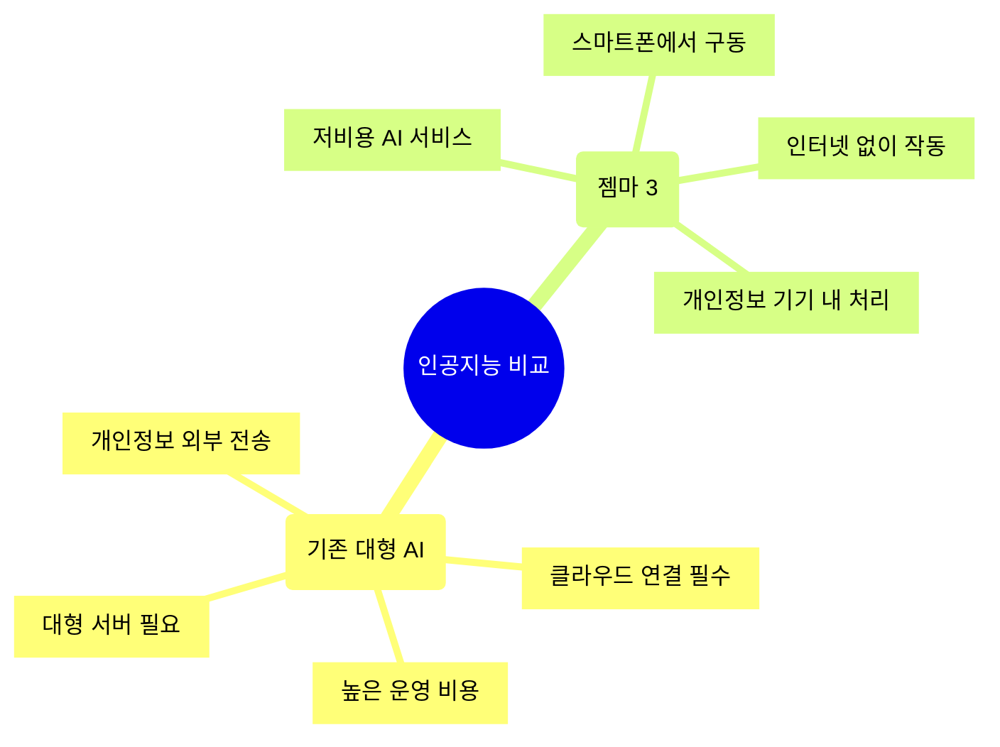
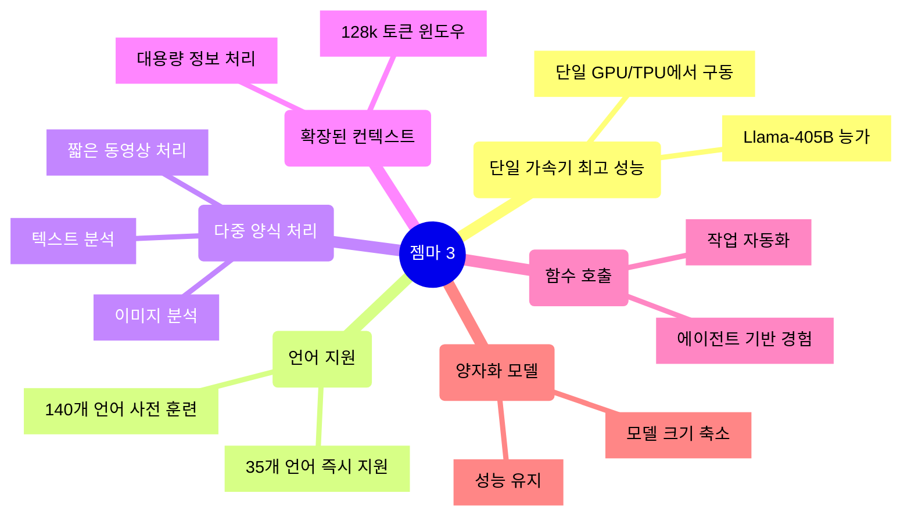
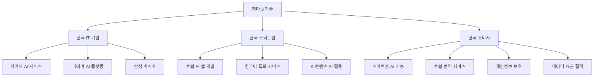

여러분, 인공지능 분야에 또 하나의 큰 물결이 찾아왔습니다. 구글이 최근 자사의 오픈소스 AI 모델 '젬마(Gemma)'의 차세대 버전인 '젬마 3(Gemma 3)'를 공개했기 때문인데요. 첫 등장 이후 단 1년 만에 1억 건 이상의 다운로드와 6만 개 이상의 변형 모델을 만들어낸 젬마가 이제 더욱 강력한 성능으로 돌아왔습니다. 이 소식이 우리의 일상에 어떤 변화를 가져올지, 함께 살펴보겠습니다.

<!--more-->

## '젬마 3'가 무엇이고, 무엇이 달라졌을까?

쉽게 설명하자면, 젬마 3는 작고 가벼운 인공지능 '두뇌'라고 생각하시면 됩니다. 지금까지의 고급 인공지능은 대형 서버실에 있는 슈퍼컴퓨터급 장비에서만 돌아갔는데요. 젬마 3는 여러분의 스마트폰이나 노트북에서도 돌아갈 수 있게 만들어진 '미니 AI'입니다.

마치 대기업 본사에서만 가능했던 일을 동네 프랜차이즈 매장에서도 할 수 있게 된 것과 비슷하다고 할까요? 게다가 본사급 퀄리티를 유지하면서 말이죠.

이번에 출시된 젬마 3는 1B(10억), 4B(40억), 12B(120억), 27B(270억) 등 다양한 크기로 제공되어 개발자들이 자신의 하드웨어와 성능 요구사항에 맞는 모델을 선택할 수 있게 되었습니다. 특히 가장 작은 1B 모델은 자원이 제한된 기기에서도 AI를 구동할 수 있는 가능성을 넓혔다는 점에서 의미가 있습니다.

## 젬마 3의 주요 기능과 특징



젬마 3가 갖춘 새로운 능력들을 살펴보면 다음과 같습니다:

1. **단일 가속기로 최고 성능 구현**: 인간 선호도 평가에서 Llama-405B, DeepSeek-V3, o3-mini 등 다른 모델들을 능가하는 성능을 보여주고 있습니다. 단일 GPU나 TPU에서 구동 가능한 크기로 이러한 성능을 낸다는 것이 핵심입니다.

2. **140개 언어 지원**: 개발자들이 전 세계 사용자를 위한 애플리케이션을 만들 수 있도록 35개 이상의 언어에 대한 즉시 지원과 140개 이상의 언어에 대한 사전 훈련 지원을 제공합니다. 특히 한국어는 35개 주요 언어에 포함되어 있어, 우리나라 사용자들에게 더욱 유용할 것으로 보입니다.

3. **다중 양식 처리 능력**: 텍스트뿐만 아니라 이미지와 짧은 동영상도 분석할 수 있어, 보다 상호작용적이고 지능적인 애플리케이션 개발이 가능해졌습니다.

4. **확장된 컨텍스트 윈도우**: 12만 8천 토큰의 컨텍스트 윈도우를 제공하여 대량의 정보를 처리하고 이해할 수 있게 되었습니다. 이는 한 권의 소설 전체를 한 번에 모델에 입력할 수 있는 수준입니다.

5. **함수 호출 지원**: 함수 호출과 구조화된 출력을 지원하여 작업 자동화와 에이전트 기반 경험을 구축할 수 있게 되었습니다.

6. **양자화 모델 제공**: 공식 양자화 버전을 도입하여 모델 크기와 컴퓨팅 요구사항을 줄이면서도 높은 정확도를 유지할 수 있게 되었습니다.

## 우리 일상에 어떤 변화가 올까요?

### 1. 인터넷 없이도 통역사를 주머니에

해외여행 가서 "This is too expensive"(너무 비싸요)라고 말하고 싶은데 영어를 잊었다고요? 인터넷이 안 되는 산속이나 비행기 안에서도 젬마 3 기반 번역 앱은 작동합니다. 여러분의 스마트폰이 실시간 통역사로 변신하는 거죠.

### 2. 사진 한 장으로 정보 파악

친구가 보낸 식당 메뉴판 사진에서 무엇이 맛있을지 추천해주거나, 길거리에서 발견한 식물이 무엇인지 알려주는 앱이 더 똑똑해집니다. 젬마 3는 이미지를 분석하는 능력이 있어서, 여러분이 찍은 사진을 보고 다양한 정보를 알려줄 수 있어요.

### 3. 개인정보, 이제 내 손안에

지금까지의 AI 서비스는 여러분의 질문이나 사진을 클라우드로 보내 처리했습니다. 하지만 젬마 3는 여러분의 기기에서 직접 처리할 수 있어 개인정보가 외부로 나가지 않습니다. 인터넷 연결 없이도 작동하니 데이터 요금도 절약되고요.

## 한국 시장에 미칠 영향

### 1. K-디지털 콘텐츠의 새로운 무기

우리나라는 웹툰, K-드라마, K-POP 등 디지털 콘텐츠 강국인데요. 젬마 3를 활용하면 이런 콘텐츠를 더 스마트하게 제작하고 소비할 수 있습니다. 예를 들어, 웹툰 자동 번역 서비스가 더 정확해지고, 넷플릭스 같은 OTT에서 K-드라마를 보다 정교하게 추천해줄 수 있게 됩니다.

### 2. 한국형 AI 앱 시장 성장

우리나라 IT 기업들은 카카오미니, NUGU 등 인공지능 스피커를 이미 출시했지만, 성능 면에서는 구글 등 해외 기업에 비해 아쉬운 점이 있었습니다. 젬마 3는 오픈소스(누구나 무료로 사용하고 수정할 수 있는)이기 때문에, 한국 기업들도 이를 활용해 더 똑똑한 AI 서비스를 만들 수 있습니다.

### 3. 중소기업, 소상공인도 AI 혜택을

지금까지 고급 AI는 네이버, 카카오 같은 대기업만 활용할 수 있었습니다. 하지만 젬마 3는 소규모 회사나 개인 개발자도 쉽게 활용할 수 있어요. 동네 꽃집이 식물 인식 앱을 만들거나, 지역 맛집이 메뉴 추천 AI를 도입하는 등 중소상공인도 AI 혜택을 누릴 수 있게 됩니다.

## 일상 속 젬마 3 활용 사례

### "아침에 일어나면..."

아침에 일어나 스마트폰을 보면, 젬마 3 기반 앱이 오늘의 날씨에 맞는 옷차림을 추천해줍니다. 여러분의 옷장 사진을 분석해 "오늘처럼 비 오는 날엔 이 청바지에 이 재킷이 어울려요"라고 알려주는 거죠. 인터넷 연결 없이도요!

### "점심 메뉴를 고민할 때..."

회사 근처 식당 메뉴판을 찍으면, 여러분의 식습관과 알레르기 정보를 고려해 건강에 좋은 메뉴를 추천해줍니다. 모든 정보는 여러분의 폰 안에서만 처리되니 개인정보 걱정도 없고요.

### "퇴근길 지하철에서..."

지하철에서 인터넷이 끊겨도 괜찮아요. 젬마 3 기반 앱으로 오프라인에서도 외국어 공부를 하거나, 다운로드 받은 문서를 AI가 요약해줄 수 있으니까요.

## 안전성에 대한 고려

구글은 젬마 3의 개발 과정에서 안전성을 중요하게 고려했다고 밝혔습니다. 특히 개방형 모델이 가질 수 있는 위험성을 평가하고, 혁신과 안전 사이의 균형을 맞추기 위해 모델 능력에 맞는 테스트 강도를 조정했다고 합니다.

젬마 3 개발 과정에는 광범위한 데이터 거버넌스, 미세 조정을 통한 안전 정책 조정, 강력한 벤치마크 평가 등이 포함되었습니다. 특히 젬마 3의 향상된 STEM(과학, 기술, 공학, 수학) 성능으로 인해 유해 물질 제작에 오용될 가능성에 대한 평가를 진행했으며, 그 결과 위험 수준이 낮은 것으로 나타났다고 합니다.

더불어 구글은 이미지 안전을 위한 'ShieldGemma 2'도 함께 출시했습니다. 이는 젬마 3를 기반으로 한 4B 크기의 이미지 안전 검사기로, 위험한 콘텐츠, 성적으로 노골적인 콘텐츠, 폭력적 콘텐츠 등 세 가지 안전 범주에 걸쳐 안전 레이블을 출력합니다. 개발자들은 자신의 안전 요구사항과 사용자에 맞게 ShieldGemma를 추가로 사용자 정의할 수 있습니다.

## 젬마 3 시작하기

젬마 3는 다양한 개발 도구 및 플랫폼과 원활하게 통합되도록 설계되었습니다. Hugging Face Transformers, Ollama, JAX, Keras, PyTorch, Google AI Edge, UnSloth, vLLM, Gemma.cpp 등 다양한 도구를 지원하여 개발자들이 자신의 프로젝트에 가장 적합한 도구를 선택할 수 있는 유연성을 제공합니다.

시작하는 방법도 다양합니다:
- [Google AI Studio](https://aistudio.google.com/prompts/new_chat)에서 바로 젬마 3를 사용해볼 수 있습니다.
- [Kaggle](https://www.kaggle.com/models/google/gemma-3)이나 [Hugging Face](https://huggingface.co/blog/gemma3), [ollama](https://ollama.com/library/gemma3)를 통해 모델을 다운로드할 수 있습니다.
- Google Colab, Vertex AI, 또는 게이밍 GPU 등에서 모델을 훈련하고 조정할 수 있습니다.
- Vertex AI, Cloud Run, Google GenAI API, 로컬 환경 등 다양한 배포 옵션을 선택할 수 있습니다.

## 젬마버스(Gemmaverse)와 학술 프로그램

> [!NOTE] 
> SEA-LION은 "Southeast Asian Languages In One Network"의 약자로, AI Singapore가 동남아시아 지역의 저자원 언어와 소외된 인구 집단을 위해 개발한 오픈소스 프로젝트입니다. 이 모델은 서구나 중국 모델과 달리 동남아시아 언어로 생성된 콘텐츠를 더 많이 학습하여 지역 문화적 맥락과 언어적 뉘앙스를 더 잘 이해합니다. SEA-LION v3는 AI Singapore가 개발한 동남아시아 지역을 위한 대규모 언어 모델(LLM)입니다. 이 모델은 동남아시아의 다양한 언어와 문화적 맥락을 더 잘 이해하도록 특별히 설계되었습니다. SEA-LION v3는 Google의 Gemma 2 아키텍처를 기반으로 하며, 동남아시아 지역의 200억 개 토큰 데이터로 학습되었습니다. 이 모델은 영어를 포함한 11개의 동남아시아 언어(버마어, 중국어, 영어, 필리핀어, 인도네시아어, 크메르어, 라오어, 말레이어, 타밀어, 태국어, 베트남어)를 지원하며, 자바어와 수단어도 추가로 지원합니다.

젬마 생태계는 이미 활발하게 성장하고 있습니다. AI Singapore의 [SEA-LION v3](https://sea-lion.ai/our-models/)는 동남아시아 전역의 언어 장벽을 허물고 소통을 촉진하고 있으며, INSAIT의 BgGPT는 불가리아어를 우선시하는 대형 언어 모델로서 젬마가 다양한 언어를 지원하는 힘을 보여주고 있습니다. Nexa AI의 OmniAudio는 온디바이스 AI의 가능성을 보여주며 고급 오디오 처리 기능을 일상 기기에 제공하고 있습니다.

또한 구글은 학술 연구 혁신을 촉진하기 위해 '젬마 3 학술 프로그램'을 시작했습니다. 학술 연구자들은 젬마 3 기반 연구를 가속화하기 위한 구글 클라우드 크레딧(1만 달러 상당)을 신청할 수 있습니다.

## 앞으로의 전망

젬마 3의 등장은 한국에서도 AI 대중화의 큰 전환점이 될 것으로 보입니다. 특히 한국은 세계 최고 수준의 스마트폰 보급률과 IT 인프라를 갖추고 있어, 젬마 3를 활용한 서비스가 빠르게 확산될 것으로 예상됩니다.

또한 젬마 3는 140개 언어를 지원하는데, 이는 한국 기업들이 글로벌 시장으로 진출할 때 언어 장벽을 낮추는 데 큰 도움이 될 것입니다. K-드라마나 K-POP이 전 세계로 퍼져나가는 데 더욱 힘을 실어줄 수 있겠죠.

무엇보다, 젬마 3는 일상 속 작은 불편함을 해소하는 데 큰 역할을 할 것입니다. 스마트폰 배터리는 아끼면서도, 더 똑똑한 AI 서비스를 이용할 수 있게 되니까요.

이제 인공지능은 클라우드에만 있는 것이 아니라, 여러분의 주머니 속에 있게 됩니다. 가볍고 강력한 성능, 다양한 언어 지원, 멀티모달 기능, 그리고 다양한 크기의 모델 제공 등은 더 많은 개발자들이 AI 기술을 활용할 수 있는 기회를 열어줄 것으로 기대됩니다. 특히 스마트폰이나 노트북과 같은 일반 소비자 기기에서도 고성능 AI를 구동할 수 있게 됨에 따라, 우리의 일상생활에서 경험하는 AI 애플리케이션의 품질과 다양성이 크게 향상될 것으로 예상됩니다.

여러분의 일상은 어떻게 바뀔까요? 그 변화가 벌써부터 기대됩니다.