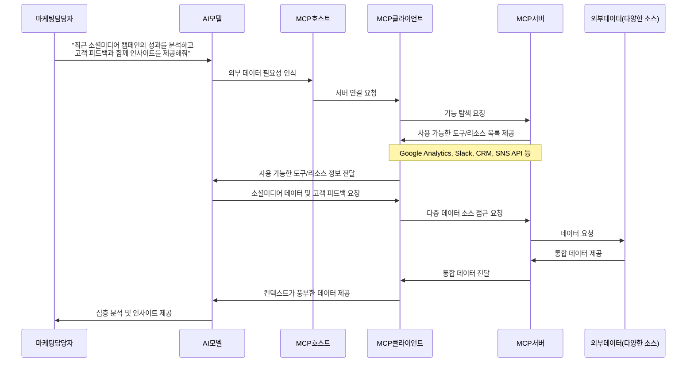
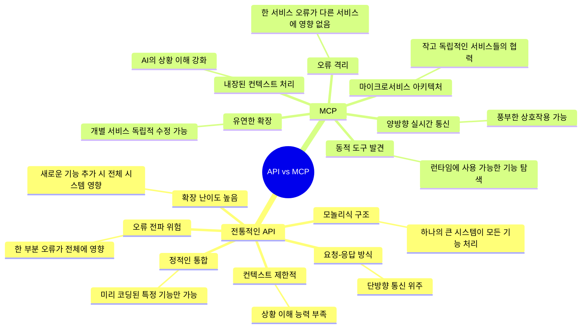

AI가 당신의 데이터와 대화할 수 있다면 어떨까요? Model Context Protocol(MCP)이 바로 그 꿈을 현실로 만들고 있습니다.

<!--more-->

## 🌟 AI 세상의 새로운 소통 표준, MCP가 등장하다

스마트폰 충전기의 변화를 기억하시나요? 예전에는 휴대폰 브랜드마다 충전 케이블이 제각각이었지만, 지금은 대부분 USB-C 타입으로 통일되고 있습니다. 이런 표준화 덕분에 어느 충전기든 빌려쓸 수 있고, 새 기기를 구매해도 기존 케이블을 그대로 사용할 수 있게 되었죠. 이런 표준화가 가져온 편리함을 AI 세계에서도 누릴 수 있다면 어떨까요?

Anthropic에서 개발한 'MCP(Model Context Protocol)'는 바로 이런 필요성에 응답하여 등장했습니다. MCP는 AI 모델, 특히 대규모 언어 모델(LLM)이 외부 시스템과 데이터를 주고받는 방식을 표준화하는 오픈 프로토콜입니다. Anthropic은 이를 "AI 애플리케이션을 위한 USB-C 포트와 같다"고 비유했는데, 이는 매우 적절한 표현입니다. 마치 USB 포트가 다양한 기기를 컴퓨터에 연결하듯, MCP는 AI 모델이 다양한 도구와 데이터베이스에 일관된 방식으로 연결할 수 있게 해주는 범용 커넥터인 셈이죠.

## 🔍 MCP, 왜 지금 필요한가요?

현재 AI 개발 현장을 들여다보면, 많은 개발자들이 각자 다른 환경과 데이터 소스를 연결하기 위해 '일회성 통합'을 만드느라 진땀을 흘리고 있습니다. 이는 마치 가전제품마다 다른 형태의 전원 플러그를 사용해야 하는 것처럼 비효율적이고 번거로운 상황입니다.

### 실제 상황으로 이해하기

가령 한 회사가 고객 서비스 챗봇을 개발한다고 상상해 봅시다. 이 챗봇은 다음과 같은 다양한 정보에 접근해야 합니다:
- 구글 드라이브에 저장된 제품 매뉴얼
- Slack에 올라온 고객 피드백
- 회사 내부 CRM 시스템의 고객 데이터
- GitHub의 기술 문서와 이슈 트래커

기존 방식에서는 개발팀이 각 플랫폼마다 개별적인 연결 방식(API 연동)을 개발해야 했습니다. 그리고 새로운 데이터 소스가 추가될 때마다 또 다른 연결 방식을 만들어야 했죠. 이는 마치 새 가전제품을 살 때마다 새로운 형태의 콘센트를 벽에 설치해야 하는 것과 같은 비효율성을 초래합니다.

MCP는 이런 문제를 해결하기 위해 "모든 연결을 위한 하나의 표준"을 제공합니다. 이를 통해 AI 모델은 Google Drive 문서, Slack 메시지, 공식 API 문서, 내부 데이터베이스 등 다양한 외부 데이터 소스에 일관된 방식으로 접근할 수 있게 됩니다. 마치 모든 가전제품이 표준화된 콘센트에 꽂히는 것처럼 말이죠.

## 💻 MCP는 어떻게 작동하나요?

MCP의 작동 방식을 더 깊이 이해하기 위해 실제 비즈니스 상황을 상상해 볼까요? 한 마케팅 회사에서 AI 어시스턴트를 사용해 다양한 데이터 소스에서 마케팅 인사이트를 도출하고 싶다고 가정해 봅시다.

이 다이어그램에서 볼 수 있듯이, MCP는 다음과 같은 단계로 작동합니다:

### 1. 기능 탐색 (Discovery)

사용자가 "최근 소셜미디어 캠페인의 성과를 분석하고 고객 피드백과 함께 인사이트를 제공해줘"라는 질문을 던지면, AI 모델은 이 질문을 처리하기 위해 외부 데이터가 필요하다고 판단합니다. 이때 MCP 클라이언트는 서버에 "당신이 제공할 수 있는 기능이 무엇인가요?"라고 물어봅니다. 서버는 "Google Analytics 데이터 접근, Slack 대화 검색, CRM 고객 데이터 조회, SNS API 연결" 등의 기능 목록을 제공합니다.

이는 마치 여러분이 처음 방문한 식당에서 메뉴판을 받아보는 것과 같습니다. 메뉴판을 보고 나서야 어떤 음식을 주문할 수 있는지 알게 되죠.

### 2. 증강된 프롬프팅 (Enhanced Prompting)

이제 AI 모델은 사용자의 질문과 서버에서 제공받은 기능 목록을 함께 고려합니다. 이 과정에서 AI는 "이 질문에 답하기 위해서는 Google Analytics의 캠페인 데이터와 Slack의 고객 피드백이 필요하겠구나"라고 판단할 수 있습니다.

이는 여러분이 메뉴판을 보고 "오늘 점심으로는 샐러드와 스테이크가 좋겠다"고 결정하는 것과 유사합니다.

### 3. 도구/리소스 선택 (Tool Selection)

AI 모델은 필요한 도구들을 선택하고 MCP 클라이언트에게 "Google Analytics에서 최근 30일간의 소셜미디어 캠페인 데이터와 Slack에서 관련 고객 피드백을 가져와주세요"라고 요청합니다.

이는 식당에서 웨이터에게 주문을 하는 것과 같습니다. "샐러드와 미디움 레어로 구운 스테이크 주세요"라고 말하는 것처럼요.

### 4. 서버 실행 (Server Execution)

MCP 클라이언트는 AI 모델의 요청을 받아 MCP 서버에 전달합니다. 서버는 여러 외부 데이터 소스에 접근하여 필요한 데이터를 수집합니다. Google Analytics에서는 캠페인 성과 지표를, Slack에서는 고객 피드백 메시지를 가져옵니다.

이는 웨이터가 주방에 가서 요리사에게 주문을 전달하고, 요리사가 필요한 재료를 모아 요리를 준비하는 과정과 비슷합니다.

### 5. 응답 생성 (Response Generation)

수집된 데이터는 MCP 서버에서 MCP 클라이언트를 통해 AI 모델에게 전달됩니다. AI 모델은 이 풍부한 컨텍스트를 바탕으로 캠페인 성과와 고객 피드백을 연결하여 심층적인 인사이트를 생성합니다.

"Instagram 캠페인은 18-24세 사용자 층에서 높은 참여율을 보였으며, 이 연령대의 고객들은 특히 제품의 지속가능성에 대해 긍정적인 피드백을 남겼습니다. 반면, Facebook 캠페인은 35-44세 사용자 층에서 전환율이 높았지만, 가격 정책에 대한 우려가 여러 차례 언급되었습니다."

이는 웨이터가 완성된 요리를 여러분의 테이블에 가져다주는 것과 같습니다.

## 📊 전통적인 API와 MCP의 차이점

MCP의 혁신성을 더 잘 이해하기 위해 기존의 API 통합 방식과 비교해 볼까요?

### 구체적인 예시로 차이점 이해하기

실제 사용 사례를 통해 이 차이점을 살펴봅시다. 한 기업이 고객 서비스 챗봇을 개발하고 있다고 가정해 보겠습니다:

**전통적인 API 방식**:
1. 개발자는 각 시스템(CRM, 지식 베이스, 주문 시스템 등)에 대한 별도의 API 통합을 구축해야 합니다.
2. 각 API는 고유한 인증 방식, 데이터 형식, 오류 처리 방식을 가지고 있어 복잡성이 증가합니다.
3. 새로운 시스템이 추가될 때마다 새로운 통합 작업이 필요합니다.
4. 챗봇은 미리 프로그래밍된 작업만 수행할 수 있으며, 예상치 못한 질문이나 작업에 유연하게 대응하기 어렵습니다.

**MCP 방식**:
1. 개발자는 각 시스템에 대한 MCP 서버를 구축하거나 기존 서버를 사용합니다.
2. 챗봇의 AI 모델은 MCP를 통해 사용 가능한 모든 도구와 리소스를 동적으로 발견합니다.
3. 사용자 질문에 따라 AI 모델은 적절한 도구를 선택하여 정보를 검색하고 작업을 수행합니다.
4. 새로운 시스템이 추가되면 해당 MCP 서버를 연결하기만 하면 됩니다.
5. 챗봇은 기존에 경험하지 못한 질문이나 작업에도 더 유연하게 대응할 수 있습니다.

이러한 접근 방식의 차이는 마치 고정된 메뉴만 제공하는 패스트푸드점과, 재료와 조리법을 동적으로 조합하여 고객 취향에 맞는 요리를 제공하는 맞춤형 레스토랑의 차이와 같습니다.

## 🚀 MCP가 가져올 업계 변화

MCP가 널리 채택된다면, AI 개발 환경과 사용자 경험은 어떻게 변화할까요? 몇 가지 중요한 변화를 구체적인 사례와 함께 살펴보겠습니다:

### 1. 개발 속도와 효율성의 혁명적 향상

**현재 상황**: 한 금융 기술 스타트업이 AI 기반 재무 관리 앱을 개발하고 있습니다. 이 앱은 사용자의 은행 계좌, 투자 포트폴리오, 세금 정보, 지출 패턴 등 다양한 데이터 소스에 접근해야 합니다. 개발팀은 각 금융 기관과 서비스마다 별도의 API 통합을 개발해야 하며, 이 작업에만 6개월이 소요될 것으로 예상됩니다.

**MCP 적용 후**: 주요 금융 기관과 서비스가 MCP 서버를 제공하기 시작하면, 개발팀은 표준화된 방식으로 이들을 연결할 수 있습니다. 기존 MCP 컴포넌트를 재사용하고 플러그 앤 플레이 방식으로 통합함으로써 개발 기간을 6개월에서 6주로 단축할 수 있습니다. 또한, 새로운 금융 서비스가 출시될 때마다 해당 MCP 서버를 추가하기만 하면 됩니다.

### 2. 컨텍스트 인식이 강화된 AI 경험

**현재 상황**: 대기업의 직원들이 내부 지식 베이스를 검색하기 위해 AI 비서를 사용하고 있습니다. 하지만 AI는 2023년에 훈련된 데이터만 알고 있어, 회사의 최신 제품 출시, 조직 변경, 정책 업데이트 등에 대해 알지 못합니다. 직원들은 종종 오래된 정보를 받고 혼란을 겪습니다.

**MCP 적용 후**: AI 비서는 MCP를 통해 회사의 SharePoint, Confluence, Slack, 이메일 아카이브, HR 시스템 등에 실시간으로 접근할 수 있습니다. 직원이 "새로운 육아휴직 정책이 어떻게 되나요?"라고 물으면, AI는 최신 HR 문서를 검색하고 최근 업데이트된 정책 정보를 정확하게 제공할 수 있습니다. 사내 지식이 업데이트될 때마다 AI의 응답도 자동으로 최신 상태를 유지합니다.

### 3. 보안과 확장성의 균형

**현재 상황**: 의료 서비스 제공업체가 환자 데이터에 접근하는 AI 진단 보조 도구를 개발하고 있습니다. 개발팀은 데이터 보안과 개인정보 보호를 위해 엄격한 접근 통제를 구현해야 하지만, 동시에 다양한 의료 시스템과 통합해야 하는 과제에 직면해 있습니다. 이로 인해 개발이 지연되고 비용이 증가합니다.

**MCP 적용 후**: MCP의 내장된 보안 메커니즘은 연결 격리와 세분화된 권한 관리를 제공합니다. 의료 서비스 제공업체는 MCP를 통해 환자 데이터에 대한 접근을 안전하게 제어하면서도, 다양한 의료 시스템과 쉽게 통합할 수 있습니다. 새로운 의료 기기나 진단 도구가 추가될 때마다 해당 MCP 서버를 연결하기만 하면 됩니다. 이는 보안을 유지하면서도 시스템을 유연하게 확장할 수 있게 해줍니다.

## 🌐 MCP의 실제 활용 사례

MCP는 이미 다양한 산업과 사용 사례에서 적용되고 있습니다. 구체적인 예시를 통해 그 잠재력을 살펴보겠습니다:

### 1. 소프트웨어 개발 워크플로우 혁신

**시나리오**: 한 소프트웨어 회사의 개발팀은 코드 리뷰와 품질 관리에 많은 시간을 소비하고 있습니다. 특히 대규모 Pull Request(PR)를 검토하는 일은 시간이 많이 걸리고 중요한 이슈를 놓치기 쉽습니다.

**MCP 활용**: 이 회사는 다음과 같은 MCP 기반 워크플로우를 구축했습니다:
- GitHub MCP 서버를 통해 PR 세부 정보와 변경된 파일을 가져옵니다.
- Claude Desktop 애플리케이션이 MCP를 통해 코드 변경 사항을 분석합니다.
- AI는 코드 품질, 잠재적 버그, 보안 취약점 등을 식별하고 PR 리뷰 요약과 제안을 생성합니다.
- Notion MCP 서버를 통해 리뷰 내용을 팀의 문서 저장소에 자동으로 저장합니다.

**결과**: 이 워크플로우는 코드 리뷰 시간을 60% 단축하고, 중요한 이슈 감지율을 40% 향상시켰습니다. 개발자들은 반복적인 리뷰 작업에서 벗어나 창의적인 문제 해결에 더 집중할 수 있게 되었습니다.

### 2. 의료 연구 가속화

**시나리오**: 한 의학 연구 기관은 방대한 의학 문헌, 임상 시험 데이터, 유전체 데이터베이스를 분석하여 새로운 치료법을 발견하려고 합니다. 이 데이터는 서로 다른 시스템에 분산되어 있어 통합적인 분석이 어렵습니다.

**MCP 활용**: 연구 기관은 다음과 같은 MCP 솔루션을 구축했습니다:
- PubMed MCP 서버를 통해 최신 의학 문헌에 접근합니다.
- 임상 시험 데이터베이스 MCP 서버를 통해 진행 중인 연구 데이터를 조회합니다.
- 유전체 데이터베이스 MCP 서버를 통해 유전자 변이와 질병 연관성 데이터를 분석합니다.
- AI는 이 모든 소스에서 얻은 정보를 통합하여 새로운 치료 가능성을 제안합니다.

**결과**: 연구자들은 이전에는 몇 개월이 걸렸을 통합 분석을 며칠 만에 수행할 수 있게 되었습니다. 이로 인해 희귀 질환에 대한 새로운 치료법 후보를 몇 가지 발견했으며, 연구 속도가 크게 향상되었습니다.

### 3. 개인화된 교육 경험

**시나리오**: 온라인 교육 플랫폼은 학생들에게 맞춤형 학습 경험을 제공하고자 합니다. 각 학생의 학습 스타일, 진도, 강점과 약점에 따라 콘텐츠를 조정해야 합니다.

**MCP 활용**: 교육 플랫폼은 다음과 같은 MCP 생태계를 구축했습니다:
- 학습 관리 시스템(LMS) MCP 서버를 통해 학생의 진도와 성과 데이터에 접근합니다.
- 콘텐츠 저장소 MCP 서버를 통해 다양한 형식(비디오, 텍스트, 퀴즈 등)의 교육 자료에 접근합니다.
- 평가 엔진 MCP 서버를 통해 학생의 이해도를 실시간으로 평가합니다.
- AI 튜터는 이러한 데이터 소스를 활용하여 각 학생에게 최적화된 학습 경로를 생성합니다.

**결과**: 학생들은 자신의 학습 속도와 스타일에 맞춘 개인화된 교육 경험을 받게 되었습니다. 학습 성과가 평균 25% 향상되었고, 플랫폼 만족도도 크게 증가했습니다.

## 🔮 MCP의 미래와 발전 방향

MCP는 아직 초기 단계이지만, 그 잠재력은 매우 큽니다. 앞으로 어떤 방향으로 발전할지 살펴보겠습니다:

### 1. 산업별 특화 MCP 생태계

다양한 산업(의료, 금융, 법률, 교육 등)에 특화된 MCP 서버와 도구가 등장할 것입니다. 예를 들어, 의료 분야에서는 전자 건강 기록(EHR), 의료 영상, 약물 데이터베이스 등에 특화된 MCP 서버가 개발될 수 있습니다. 이는 각 산업의 특수한 요구사항과 규제를 충족하면서도 AI 통합을 간소화할 것입니다.

### 2. MCP 마켓플레이스와 에코시스템

개발자들이 자신의 MCP 서버와 도구를 공유하고 판매할 수 있는 마켓플레이스가 등장할 것입니다. 이는 WordPress 플러그인 마켓플레이스나 모바일 앱 스토어와 유사한 생태계를 형성할 것입니다. 개발자들은 자신의 특화된 MCP 솔루션을 개발하여 수익을 창출하고, 사용자들은 필요에 맞는 도구를 쉽게 찾아 설치할 수 있을 것입니다.

### 3. 분산형 AI 네트워크

장기적으로 MCP는 분산형 AI 네트워크의 기반이 될 수 있습니다. 다양한 AI 모델, 데이터 소스, 도구가 MCP를 통해 상호 연결되어 협력적으로 문제를 해결하는 네트워크가 형성될 수 있습니다. 이는 인터넷이 컴퓨터들을 연결했듯이, AI 시스템들을 연결하는 "AI 인터넷"의 시작이 될 수 있습니다.

### 4. 국제 표준화

MCP가 성숙함에 따라 국제 표준화 기구(ISO, IEEE 등)에서 공식 표준으로 채택될 가능성이 있습니다. 이는 다양한 벤더와 플랫폼 간의 상호운용성을 보장하고, MCP의 광범위한 채택을 촉진할 것입니다.

## 💭 마치며: MCP, AI의 새로운 인프라

인터넷이 HTTP를 통해 표준화되어 전 세계를 연결했듯이, AI 세계도 MCP와 같은 표준화된 프로토콜을 통해 더욱 연결되고 통합될 것입니다. 이는 개발자들에게는 더 효율적인 개발 환경을, 사용자들에게는 더 정확하고 맥락을 이해하는 AI 경험을 제공할 것입니다.

마치 USB 포트가 컴퓨터와 주변기기를 쉽게 연결해주듯이, MCP는 AI와 데이터 세계를 연결하는 범용 포트가 될 것입니다. 이러한 표준화된 연결은 AI 기술의 발전과 확산을 더욱 가속화할 것이며, 우리 모두가 AI의 혜택을 더 쉽게 누릴 수 있는 미래를 열어갈 것입니다.

