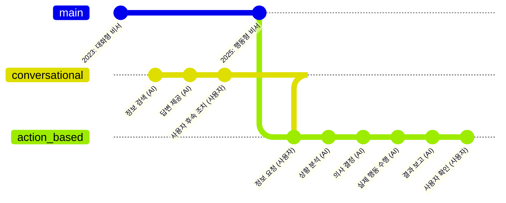
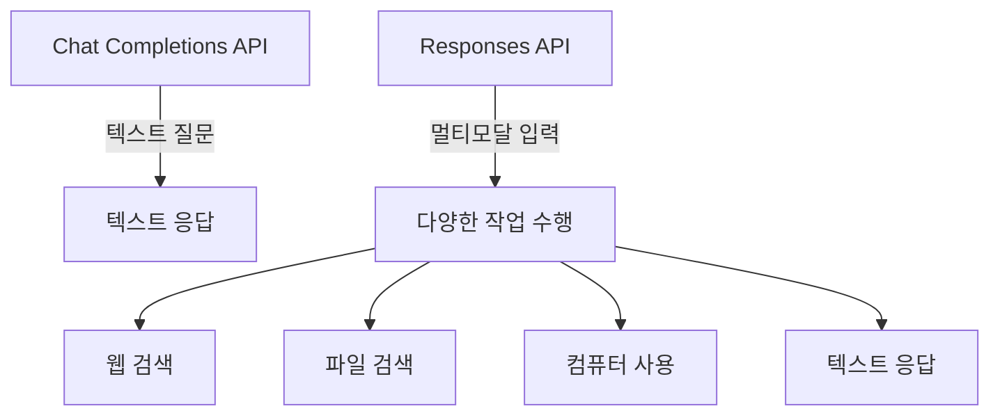
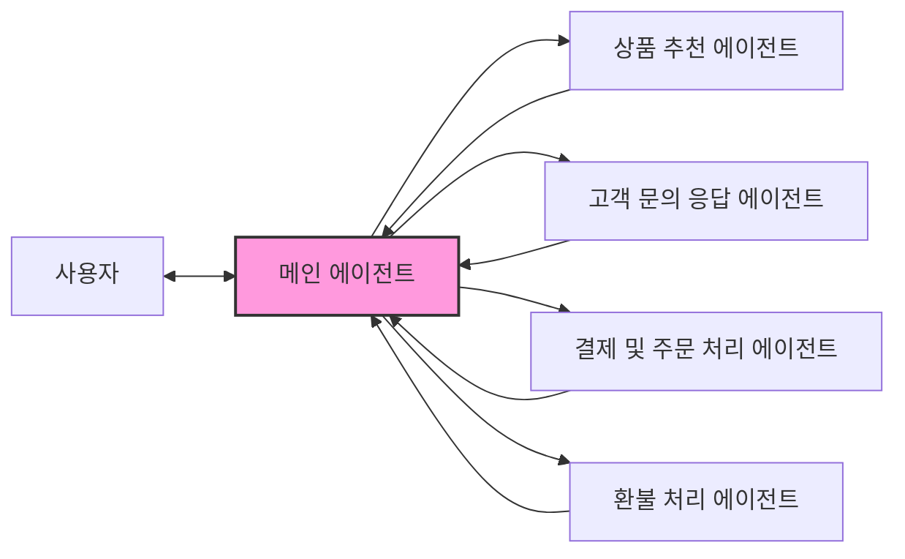
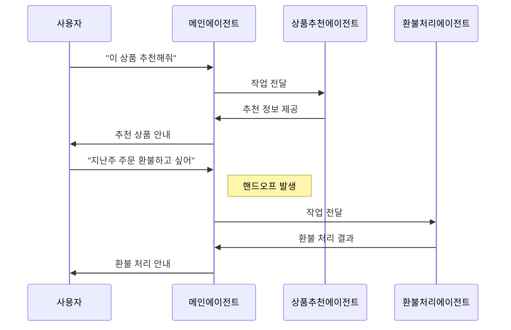
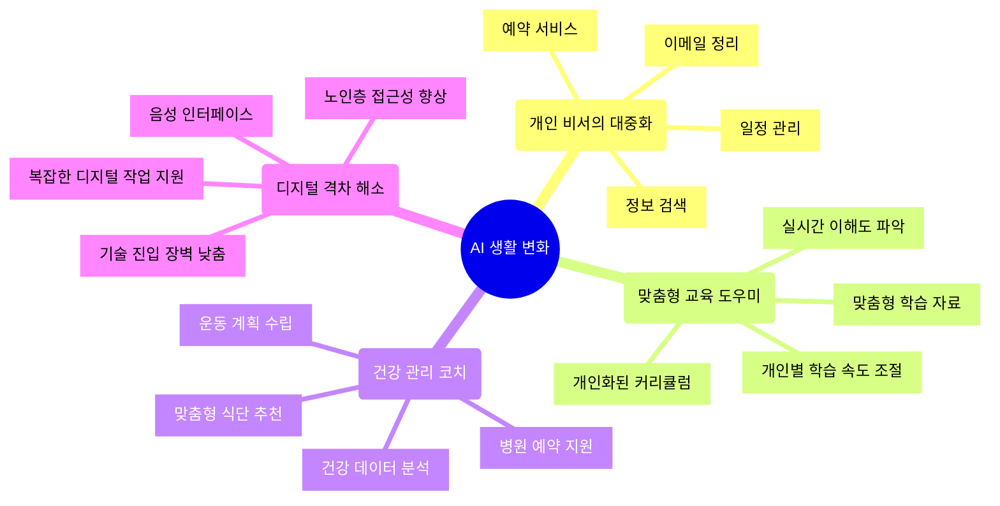

2025년은 에이전트의 해가 될 것입니다. ChatGPT와 개발자 도구들이 단순히 질문에 대답하는 것을 넘어 실제 세상에서 당신을 위해 일을 해내는 해가 될 겁니다.

<!--more-->

## 인공지능, 이제는 대신 일하는 시대로



OpenAI의 케빈이 발표의 마지막에 남긴 이 한마디는 인공지능 기술의 미래를 보여주는 중요한 신호탄입니다. 지금까지 인공지능이 '대화하는 비서'였다면, 이제는 '행동하는 비서'로 진화하고 있는 것이죠.

쉽게 생각해보세요. 지금까지의 ChatGPT가 "내일 날씨 어때?"라는 질문에 "내일은 비가 올 예정입니다"라고 대답하는 수준이었다면, 앞으로는 "내일 비가 올 예정이니 우산을 준비하고, 아침 회의 시간을 10분 늦추는 메일을 팀에 보냈습니다"라고 말하며 실제로 그 일을 해낼 수 있게 된다는 의미입니다.

## '에이전트'란 무엇일까요?

여기서 '에이전트(Agent)'란 무엇일까요? 영화 '아이언맨'의 자비스(JARVIS)를 떠올려보세요. 주인공 토니 스타크의 말을 듣고, 이해하고, 필요한 작업을 대신 수행해주는 인공지능이죠. OpenAI가 말하는 '에이전트'는 바로 이런 개념입니다. 사용자를 대신해 독립적으로 작업을 수행할 수 있는 인공지능 시스템인 것이죠.

실생활에서는 이렇게 생각해볼 수 있습니다. 지금까지의 ChatGPT가 질문에 답변해주는 선생님 같은 존재였다면, 에이전트는 여러분의 비서가 되어 "이번 주말 제주도 여행 계획 좀 세워줘"라고 말하면 항공권 가격을 찾고, 날씨를 확인하고, 숙소를 추천하고, 심지어 예약까지 도와주는 존재입니다.

## ChatGPT에서 이미 만나본 에이전트들

사실 ChatGPT 플러스 사용자라면 이미 두 가지 에이전트 기능을 경험해봤을 수도 있습니다.

첫 번째는 '오퍼레이터(Operator)'라는 기능입니다. 이 기능을 사용하면 ChatGPT가 여러분을 대신해 웹사이트를 방문하고, 정보를 검색하고, 심지어 간단한 작업(예: 이미지 다운로드, 텍스트 복사 등)까지 수행할 수 있습니다. 마치 여러분의 손이 되어 인터넷을 탐색하는 것과 같죠.

두 번째는 '딥 리서치(Deep Research)'라는 기능입니다. 여러분이 "인공지능이 일자리에 미치는 영향에 대해 연구해줘"라고 요청하면, ChatGPT는 관련 자료를 찾고, 읽고, 분석하여 상세한 보고서를 만들어줍니다. 혼자서 일주일 동안 연구해야 할 내용을 15분 만에 정리해주는 셈이죠.

OpenAI는 이런 기능들에 대한 사용자들의 반응이 매우 좋았다고 말합니다. 이제 이런 도구들을 일반 사용자뿐만 아니라, 개발자들도 자신만의 서비스에 쉽게 추가할 수 있도록 API(Application Programming Interface, 쉽게 말해 프로그램 간 소통 창구)를 통해 제공하기로 했습니다.

## 개발자들이 겪던 어려움은 무엇이었을까?

여기서 잠깐, 개발자들이 지금까지 어떤 어려움을 겪었는지 이해해봅시다. 개발자들은 인공지능 기능을 자신의 앱이나 서비스에 추가하기 위해 여러 개의 복잡한 API를 조합해야 했습니다.

이것은 마치 요리사가 맛있는 요리를 만들기 위해 여러 상점에서 재료를 사와서 직접 손질하고 조리해야 하는 것과 같습니다. 번거롭고, 시간도 많이 걸리고, 때로는 원하는 맛이 나지 않을 수도 있죠.

OpenAI의 새로운 도구들은 이런 과정을 간소화합니다. 이제 개발자들은 곧바로 사용할 수 있는 '반조리 식품'이나 '밀키트'를 받는 셈입니다. 이를 통해 더 빠르고 안정적으로 AI 기능을 추가할 수 있게 되었습니다.

## 어떤 도구들이 공개되었나요?

OpenAI가 공개한 세 가지 도구를 좀 더 일상적인 예시로 설명해보겠습니다:

### 1. 웹 검색 도구 (Web Search Tool)

[📺웹 검색 도구](https://platform.openai.com/docs/guides/tools-web-search?api-mode=chat)는 인터넷에서 최신 정보를 찾아오는 역할을 합니다. 예를 들어, 여러분이 만든 여행 앱에서 "오늘 서울 날씨는 어때?"라고 물었을 때, 이 도구는 실시간으로 인터넷을 검색하여 최신 날씨 정보를 가져옵니다.

일반 검색엔진과의 차이점은 무엇일까요? 이 도구는 단순히 검색 결과 링크만 제공하는 것이 아니라, 검색된 정보를 이해하고 분석하여 사용자의 질문에 직접적으로 답변합니다. 게다가 정보의 출처도 명확히 인용하여 신뢰성을 높입니다.

### 2. 파일 검색 도구 (File Search Tool)

[📺파일 검색 도구](https://platform.openai.com/docs/guides/tools-file-search)는 여러분의 개인 문서나 데이터에서 정보를 찾아주는 역할을 합니다. 예를 들어, 회사 내부 문서, 개인 노트, 계약서 등 수천 페이지의 문서에서 필요한 정보를 순식간에 찾아낼 수 있습니다.

이것은 마치 수천 권의 책이 있는 도서관에서 사서가 여러분이 찾는 정확한 정보가 담긴 페이지를 바로 찾아주는 것과 같습니다. 게다가 이제는 다음과 같은 새로운 기능들도 추가되었습니다:

- 메타데이터 필터링: 예를 들어, "2023년에 작성된 마케팅 관련 문서만 찾아줘"라고 요청할 수 있습니다.
- 직접 검색 엔드포인트: 개발자들이 AI 모델을 거치지 않고도 저장된 문서를 직접 검색할 수 있게 해줍니다.

### 3. 컴퓨터 사용 도구 (Computer Use Tool)

[📺컴퓨터 사용 도구](https://platform.openai.com/docs/guides/tools-computer-use)는 컴퓨터 화면을 보고 마우스와 키보드를 사용할 수 있는 AI 에이전트입니다. 쉽게 말해, AI가 여러분의 컴퓨터를 직접 조작할 수 있게 해주는 것이죠.

예를 들어, "엑셀 파일에서 지난 달 매출 데이터를 추출해서 그래프로 만들어줘"라고 요청하면, AI가 실제로 엑셀 프로그램을 열고, 데이터를 찾고, 그래프를 만드는 과정을 자동으로 수행할 수 있습니다.

특히 이 도구는 오래된 프로그램이나 웹사이트처럼 API가 없는 시스템도 조작할 수 있어 매우 유용합니다. 여러분이 평소에 반복적으로 하는 지루한 컴퓨터 작업을 AI에게 맡길 수 있다고 생각해보세요!

## 새로운 'Responses API'란 무엇인가요?

OpenAI는 이러한 도구들을 쉽게 사용할 수 있도록 'Responses API'라는 새로운 인터페이스를 발표했습니다. 이것이 왜 중요할까요?

이전의 'Chat Completions API'는 텍스트 질문을 보내면 텍스트 답변만 받는 단순한 구조였습니다. 그러나 이제 AI는 텍스트뿐만 아니라 이미지를 보고, 소리를 듣고, 웹을 검색하고, 컴퓨터를 조작하는 등 다양한 작업을 수행할 수 있습니다.

'Responses API'는 이런 복잡한 작업들을 한 번의 요청으로 처리할 수 있게 해줍니다. 예를 들어, 하나의 API 호출로 AI가 사용자의 취향을 파악하고(파일 검색), 관련 제품을 인터넷에서 찾고(웹 검색), 구매까지 도와주는(컴퓨터 사용) 복잡한 작업을 수행할 수 있게 된 것입니다.

일상적인 예시로 설명하자면, 이전에는 요리사에게 "밥 해줘", "국 끓여줘", "반찬 만들어줘"라고 각각 따로 요청해야 했다면, 이제는 "한식 식사 준비해줘"라고 한 번만 부탁해도 모든 과정을 알아서 처리해주는 것과 같습니다.

## 복잡한 시스템을 위한 'Agents SDK'

여러 에이전트들이 협력해야 하는 더 복잡한 시스템을 위해 OpenAI는 'Agents SDK'(Software Development Kit, 소프트웨어 개발 도구모음)를 공개했습니다.

이것은 어떤 의미일까요? 온라인 쇼핑몰을 예로 들어보겠습니다. 한 쇼핑몰에는 다양한 역할을 하는 여러 AI 에이전트가 필요할 수 있습니다:
- 상품 추천 에이전트
- 고객 문의 응답 에이전트
- 결제 및 주문 처리 에이전트
- 환불 처리 에이전트

'Agents SDK'는 이런 여러 에이전트들이 서로 원활하게 소통하고 작업을 주고받을 수 있게 도와줍니다. 마치 회사 내 여러 부서가 유기적으로 협력하는 것과 같죠.

특히 인상적인 기능은 '핸드오프(Handoffs)'로, 대화 중에 적절한 에이전트로 자연스럽게 전환할 수 있습니다. 예를 들어, 고객이 "이 상품 추천해줘"라고 물었다가 갑자기 "지난주에 주문한 물건 환불하고 싶어"라고 말하면, 자동으로 적절한 에이전트로 대화가 전환됩니다.

## 일반인의 삶은 어떻게 바뀔까요?

이런 기술 발전이 일반인의 삶에 어떤 영향을 미칠까요? 몇 가지 가능한 시나리오를 상상해봅시다:

1. **개인 비서의 대중화**: 지금까지 부자들만 누릴 수 있었던 개인 비서 서비스를 누구나 이용할 수 있게 됩니다. 일정 관리, 이메일 정리, 정보 검색, 예약 등 다양한 업무를 AI가 대신해줍니다.

2. **맞춤형 교육 도우미**: 학생마다 다른 학습 속도와 방식을 고려한 개인 교사가 생깁니다. "수학 기초부터 다시 배우고 싶어"라고 말하면, AI가 학생의 이해도를 파악하며 맞춤형 교육을 제공합니다.

3. **건강 관리 코치**: 사용자의 건강 데이터를 분석하고, 식단을 추천하고, 운동 계획을 세우고, 필요한 경우 병원 예약까지 도와주는 건강 관리 시스템이 가능해집니다.

4. **디지털 격차 해소**: 컴퓨터 사용이 어려운 노인이나 디지털 기기에 익숙하지 않은 사람들도 음성 명령만으로 복잡한 디지털 작업을 수행할 수 있게 됩니다.

## 앞으로의 전망

OpenAI의 케빈이 말했듯이, "2025년은 에이전트의 해"가 될 전망입니다. 인공지능이 단순한 질문 답변을 넘어 실제 세상에서 구체적인 작업을 수행하는 방향으로 빠르게 발전하고 있습니다.

물론 이런 변화가 모든 사람에게 긍정적인 것만은 아닐 수 있습니다. 일부 직업은 AI 에이전트로 대체될 가능성이 있으며, 개인정보 보호나 AI의 권한 범위 등 새로운 윤리적 문제도 생길 수 있습니다.

하지만 역사적으로 보면, 새로운 기술은 항상 일부 일자리를 대체하면서도 새로운 형태의 일자리를 창출해왔습니다. AI 에이전트 시대에도 인간은 AI를 관리하고, 훈련하고, 감독하는 새로운 역할을 맡게 될 것입니다.

OpenAI의 이번 발표는 AI 기술이 우리 일상과 비즈니스에 더 깊이 통합되는 미래의 시작점이 될 것입니다. 개발자들의 창의력과 OpenAI의 강력한 도구가 만나 어떤 혁신적인 서비스들이 탄생할지, 그 가능성은 무한해 보입니다.

AI 에이전트와 함께하는 미래, 여러분은 어떤 일상을 꿈꾸시나요?