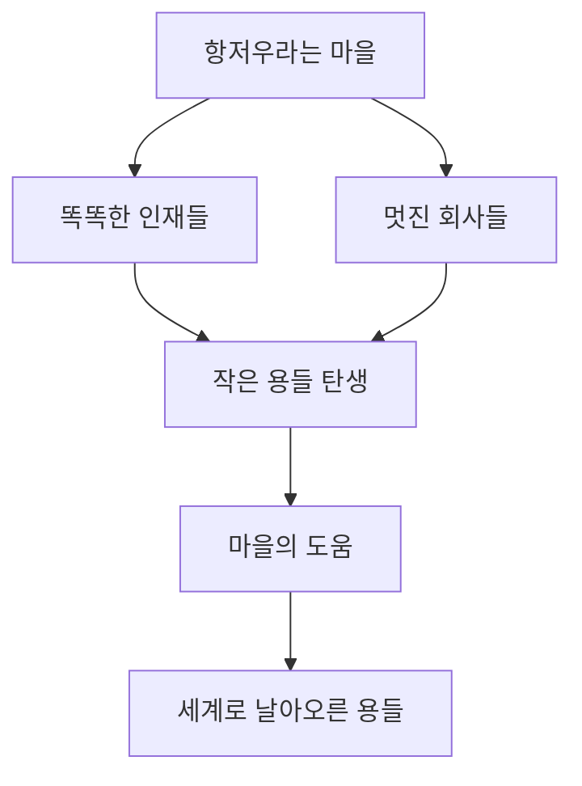

중국 항저우라는 도시에 대해 들어본 적 있나요? 상하이 근처에 자리 잡은 이 도시에 최근 별난 별명이 붙었어요. 

바로 '여섯 마리의 작은 용(Six Little Dragons)' 입니다.

<!--more-->

## 1️⃣ 작은 용들이 펼치는 큰 꿈
 
 | 회사 이름       | 하는 일                              | 주요 서비스/제품                                                                 |
|-----------------|-------------------------------------|---------------------------------------------------------------------------------|
| **딥시크 (DeepSeek)** | 인공지능 대형 언어 모델 개발           | **딥시크-R1**: 저렴하고 성능 좋은 AI 모델, 다국어 지원, "제로 코드"로 쉽게 사용 가능 |
| **게임사이언스 (Game Science)** | 고품질 비디오 게임 제작              | **검은 신화: 오공**: 중국 신화 기반 AAA 게임, 스팀에서 2,500만 장 판매         |
| **유니트리 (Unitree)** | 소비자용 로봇 개발                   | 춤추는 로봇: 설날 갈라에서 선보인 경량 로봇, 가정용/엔터테인먼트용             |
| **딥로보틱스 (DeepRobotics)** | 산업용 AI 로봇 제작                  | 산업용 로봇: 싱가포르 전력 회사 등에 납품, AI로 위험 작업 대체                 |
| **브레인코 (BrainCo)** | 뇌-컴퓨터 인터페이스 기술 개발         | 뇌파 장치: 생각으로 기계 조작, 10만 개 이상 생산, 교육/의료 응용                |
| **매니코어 (ManyCore)** | 공간 지능 AI 솔루션 제공              | 공간 설계 AI: 3D 디자인/시각화 도구, 인테리어 및 건축 산업 지원                 |

 이 별명은 여섯 개의 신생 기술 회사 `딥시크, 게임사이언스, 유니트리, 딥로보틱스, 브레인코, 매니코어` 를 가리키는데, 이름만 들으면 “그게 뭐야?” 할 수도 있겠지만, 이들이 요즘 중국에서 일으키는 파장은 마치 동화 속 용이 하늘로 솟구치는 것처럼 멋지답니다. AI부터 춤추는 로봇, 뇌로 조종하는 기계까지, 이 작은 용들은 우리가 상상만 하던 미래를 현실로 가져오고 있어요. 
 
 자, 그럼 이 용들의 모험 이야기를 함께 떠나볼까요?

---

## 2️⃣ 이슈의 배경 및 이해
### 항저우에서 깨어난 용들의 비밀

이 여섯마리 작은 용들은 각자 다른 재주를 가진 친구들 같아요. 

먼저, 딥시크를 만나볼까요? 이 회사는 지난 1월에 '딥시크-R1'이라는 똑똑한 AI를 세상에 내놨어요. 이 AI는 우리가 스마트폰으로 말 거는 시리나 빅스비 같은 친구인데, 훨씬 더 똑똑하고 가격도 저렴해서 출시 일주일 만에 마이크로소프트, 엔비디아, 알리바바 같은 세계적인 회사들이 “우리가 쓸게!” 하며 줄을 섰죠.



다음은 게임사이언스예요. 이 친구들은 ‘검은 신화: 오공’이라는 게임을 만들어 세계를 깜짝 놀라게 했어요. 옛날 텐센트라는 큰 회사에서 일하던 7명의 친구들이 “우리끼리 해보자!” 하고 뛰쳐나와 10년 동안 땀 흘린 끝에 만든 작품인데, 이 게임이 스팀에서 2,500만 장이나 팔렸대요. 영화 같은 그래픽에 중국 신화를 담은 이 게임은 마치 ‘어벤져스’ 영화처럼 전 세계 팬들을 홀렸죠.

> [!NOTE]  
> **스팀(Steam)이 뭐예요?**  스팀은 전 세계 사람들이 컴퓨터나 콘솔로 게임을 사서 즐길 수 있는 온라인 마켓이에요. 여러분이 앱스토어에서 앱을 사듯, 게이머들은 스팀에서 게임을 다운받는 거랍니다!

--- 



그리고 유니트리와 딥로보틱스는 로봇 마법사들이에요. 유니트리는 올해 중국 설날 행사에서 춤추는 로봇을 선보여 사람들을 “우와!” 하게 만들었고, 딥로보틱스는 싱가포르 전력 회사 같은 큰 고객에게 똑똑한 로봇을 팔며 실속을 챙겼어요. 

브레인코는 뇌로 기계를 움직이는 신기한 장치를 10만 개나 만들었고, 매니코어는 공간 디자인을 똑똑하게 바꾸는 AI로 주식 시장 데뷔까지 준비 중이랍니다.

이 모든 이야기가 항저우라는 도시에서 시작됐어요. 항저우는 상하이 옆에 있는, 똑똑한 인재와 돈이 모이는 곳이에요. 저장대학이라는 명문 학교가 있고, 알리바바 같은 큰 회사가 있어서 자연스레 새로운 아이디어가 샘솟는 도시죠. 

---

## 3️⃣ 문제 상황
### 용들이 깨어나자 도시가 시끌시끌

이 작은 용들이 날개를 펴며 날아오르자, 중국의 다른 지역들은 부러움 반, 걱정 반으로 술렁이기 시작했어요. 

장쑤성이라는 옆 도시는 “왜 저런 멋진 회사들이 우리 동네가 아니라 항저우에서 나왔을까?”라며 한숨을 쉬었고, 산둥성 지난 시에서는 “우리도 항저우처럼 할 수 없을까?” 하며 머리를 맞대기 시작했죠. 이 용들의 성공은 단순히 회사 이야기가 아니라, “우리 도시는 왜 저렇게 못할까?”라는 고민을 던져준 셈이에요.

항저우가 잘나가는 비결은 뭘까요? 

바로 “필요할 때 도와주고, 필요 없을 땐 내버려두는” 똑똑한 정책이에요. 

게임사이언스가 처음 시작했을 때 돈이 없어 힘들었는데, 항저우의 이촹 타운이라는 곳에서 “임대료 걱정 마, 우리 도와줄게!” 하며 손을 내밀었죠. 덕분에 망하지 않고 꿈을 키울 수 있었어요. 반면, 다른 지역은 “너무 복잡한 규칙 때문에 회사 시작하기 겁난다”는 푸념이 많아요. 마치 맛집 앞에 줄이 길어도 옆 가게는 한산한 것처럼, 환경이 얼마나 중요한지 보여주는 대목이죠.

#### 항저우가 대단한 이유, 숫자로 보면?
- **인구**: 1,200만 명이 넘는 도시로, 똑똑한 인재들이 모여들어요.  
- **대학**: 저장대학은 매년 1만 명 이상의 졸업생을 배출하며 창업의 씨앗을 뿌립니다.  
- **경제**: IT 산업만으로 매년 수조 원을 벌어들이는 중국의 보물 창고예요.  
- **기업**: 알리바바 같은 거대 기업이 둥지를 틀며 새로운 용들을 키워냈죠.

---

## 4️⃣ 용의 기지개가 펼쳐지다

#### 다른 도시의 반응, 어떻게 변하고 있나요?

이런 고민을 눈치챈 중국 곳곳에서 변화가 시작됐어요. 광둥성의 [높은 분](http://blog.e-hanaro.com/?mid=guide&category=921&page=73&document_srl=1188293)은 신년 연설에서 “화웨이도 좋지만, 딥시크와 유니트리 같은 새싹도 키워야 해!”라며 팔을 걷어붙였죠. 중국은 원래 도시마다 “내가 더 잘나가!” 하며 경쟁하는 나라예요. 지방 관리들이 GDP라는 성적표로 평가받다 보니, 항저우의 성공을 보고 “우리도 저렇게 해보자!” 하며 분주해졌답니다.

항저우의 이야기는 돈만 준다고 되는 게 아니라는 걸 보여줬어요. 똑똑한 인재가 모이고, 회사가 망하지 않게 다리 하나 놓아주는 게 중요하죠. 저장대학에서 나온 인재와 정부의 유연한 지원이 맞물리면서 작은 용들이 날아오를 수 있었던 거예요. 

- **장쑤성**: “AI 도시 타이틀을 뺏기지 않겠다!”며 스타트업에 세금 혜택을 주기 시작했어요.  
- **지난 시**: 게임 회사를 키우려고 ‘게임 산업 단지’를 짓겠다고 큰소리쳤죠.  
- **광둥성**: 딥시크와 유니트리를 언급한 뒤, 대학에 AI 연구소를 새로 열었답니다.  
- **중국 전체적으로 IT와 AI 산업을 키우자라는 목소리가 커졌어요.**

---

## 5️⃣ 우리나라에도 용이 있을지도

‘여섯마리 작은 용’은 아직 알리바바 같은 큰 용에 비하면 덩치는 작지만, 그들이 보여준 꿈은 결코 작지 않아요. 딥시크의 AI가 세계 곳곳에서 말을 걸고, 게임사이언스의 게임이 우리 집 컴퓨터로 날아오며, 유니트리의 로봇이 춤을 추는 모습을 보면, 미래가 한 뼘 더 가까워진 기분이 들죠. 

항저우에서 시작된 이 작은 날갯짓이 중국을 넘어 세계로 퍼져갈지, 대한민국에도 이런 용들이 튀어나올지, 조용히 지켜보는 것도 꽤 재밌을 것 같아요. 

여러분 주변에도 혹시 작은 용이 숨어 있지 않을까요? 

언젠가 그 용이 하늘을 날 때, 우리도 박수 쳐줄 날이 오기를 기대해봅니다.

[출처: Meet China’s ‘Six Little Dragons’](https://www.sixthtone.com/news/1016770) 